## Introduction
The advancement of Artificial Intelligence (AI) and Machine Learning (ML) has seen influence in many domain
tasks, Trajectory Prediction (TP) using historical data, contextual information, and environmental factors, aims to
forecast future positions. It has become a crucial tool revolutionizing several domains. In autonomous navigation,
TP enables self-driving vehicles to anticipate the movements of surrounding vehicles and pedestrians, facilitating
safe and efficient navigation through crowded urban streets (Y. Li et al., 2022; Xu et al., 2023). Similarly, in robotics,
TP informs the motion planning of robotic systems, enabling them to adapt their movements in real-time based
on anticipated future scenarios. Moreover, TP offers valuable insights into player movements in sports analytics,
allowing coaches and analysts to strategize and make informed decisions during gameplay Monti et al. (2021).

Over time, TP methodologies have evolved significantly, driven by advancements in deep learning, computer vision,
and robotics. Traditional approaches often relied on handcrafted features and simplistic models, which struggled to
capture the complexity and dynamics of real-world scenarios (J. Yang et al., 2022; Yu et al., 2020). However, the
emergence of deep learning models, particularly recurrent neural networks (RNNs), Convolutional Neural Networks
(CNNs), and transformer-based architectures, has revolutionized TP by enabling the automatic extraction of intricate
patterns and relationships from data(Y. Li et al., 2022; Liu et al., 2022). TP’s evolution extends beyond pedestrian
and vehicle domains, encompassing various Intelligent Transportation Systems (ITS) Z. Li et al. (2020). The ITS has
used TP to ensure the safe and efficient operation of autonomous systems, including self-driving cars, social robots,
and surveillance systems, as they navigate dynamic environments shared with humans. The interaction between
autonomous vehicles and ITS highlights the importance of accurate TP Zhang et al., 2022. This has influenced the
use of TP in the decision-making process for traffic managers to aid in collision avoidance, optimizing routes, and
ensuring smooth interactions between different types of traffic participants.

Some of the key challenges in TP are the uncertainty and variability inherent in real-world scenarios. Factors such
as non-linear motion patterns, sudden changes in direction, occlusions, and interactions between multiple agents
pose significant challenges to accurate prediction. Graph Neural Networks (GNNs) and attention mechanisms have
been introduced to address these issues in developing models capable of handling the intricate interactions between
agents. Despite progress in TP, several research gaps and challenges continue. These include the need for models that
can effectively handle long-range dependencies, incorporate contextual information, adapt to varying environmental
conditions, and provide reliable uncertainty estimates. TP’s ethical and societal implications, particularly in sensitive
areas such as surveillance and privacy, warrant careful consideration and ethical guidelines. In this context, this paper
aims to explore and contribute to the field of TP by proposing novel methodologies that expand on the state-of-the-art
(SOTA), reviewing existing approaches, and addressing key research questions. Leveraging machine learning and
deep learning techniques to advance TP and pave the way for its practical applications across diverse domains. It
aims to shed light on TP’s capabilities, limitations, and potential impact in shaping the future of intelligent systems
and decision-making processes through empirical studies, theoretical analyses, and real-world experiments.

### Purpose and Research Questions
This study addresses the problem of multi-class TP in dynamic urban environments. Given historical trajectory data
of traffic participants, such as different types of vehicles, pedestrians, and cyclists, also incorporating environmental
infrastructure in the form of static objects and roadway layouts. This infrastructure data serves as contextual infor-
mation that influences the movement and interactions of entities within the environment. The objective is to develop
a predictive model that can accurately forecast the future movements of various entities, including pedestrians, bicy-
clists, and different types of vehicles (light and heavy), within a given urban environment—in addition to utilizing
environmental infrastructure data (e.g., road layouts, pedestrian crossings, trees, signs) and historical trajectory data
to predict the future trajectories of diverse agents interacting within the environment. Traditional TP methods often
overlook the contextual information provided by environmental infrastructure, which can significantly influence the
movement patterns of entities. Much of the research is currently focused on single-class TP or multiple models for
each class utilizing only the Cartesian coordinates without incorporating environmental infrastructure. To address
this limitation, this study aims to investigate the effectiveness of Semantic Aware Spatial-Temporal Graph Trans-
formers (SA-STAR) with and without integrating environmental infrastructure information. By examining the use of
multi-class single model prediction and environmental infrastructure, this study seeks to close the gap, giving insights
into the possible implementation and results. The following research questions are addressed in this study:

>RQ1: What role does infrastructure data (e.g., road layouts, traffic signals, pedestrian crossings) play in enhancing
the accuracy and reliability of TP for different types of vehicles, bicyclists, and pedestrians?

>RQ2: How can a multi-class Trajectory Prediction (TP) model be optimized to accurately predict the movements of
pedestrians, bicyclists, and various types of vehicles in complex urban environments within a unified frame-
work?

>RQ3: Does including environmental infrastructure data in trajectory prediction models accurately forecast the inter-
actions between autonomous agents and the infrastructure in urban environments?

The motivation for this research stems from the pressing need to enhance the effectiveness of traffic management
systems in urban environments. As urbanization increases, traffic congestion and safety concerns become more
pronounced, necessitating innovative solutions to address these challenges. Suppose traffic managers can accurately
model how different agents behave with environmental changes. In that case, it can help decision-making when
proposed changes occur in an urban environment. They improve traffic management, with TP crucial for safe and
efficient navigation. However, current TP methods often need to accurately predict trajectories in complex urban
environments, limiting the potential of these systems. By leveraging advanced techniques, such as graph-based
approaches and deep learning, and integrating environmental infrastructure data, this research aims to overcome
existing limitations and develop more accurate and reliable TP models. The ultimate goal is to contribute in helping
traffic managers improve the decision process that can enhance safety, reduce congestion, and improve the overall
efficiency of urban transportation networks.

This study advances TP research and has significant practical implications. By exploring integrating environmental
infrastructure data into a unified multi-class TP model for traffic management systems, the study addresses critical
research questions regarding the impact of infrastructure data on prediction accuracy and the optimization of multi-
class prediction models. The proposed approach improves prediction accuracy and reliability by considering the
interactions of pedestrians, bicyclists, and vehicles within complex urban environments. Ultimately, this research
contributes to developing more effective and intelligent traffic management systems, directly impacting safety, efficiency, and sustainability in urban environments.

## Background
This chapter will delve into a wide array of related studies, providing valuable context and insights into the approaches researchers have employed to tackle the challenges of TP, touching on the basics as well as its evolution and
progress in research over the years and discussing various of methodologies, algorithms, and techniques for predict-
ing trajectories for moving objects, including vehicles, pedestrians, and cyclists. This chapter will also explore the
limitations and gaps in the current literature and identify areas that require further research and improvement. This
chapter aims to establish a solid foundation for understanding the SOTA in TP by synthesizing and analyzing this
diverse range of literature.

### Trajectory Prediction
By analyzing past trajectories, TP forecasts the future paths or movements of entities like pedestrians, vehicles, or
robots. This task is crucial in various domains, including autonomous driving, pedestrian tracking, and robotics,
where anticipating the future behaviors of entities is essential for safe and efficient navigation. Initially, TP relied on
handcrafted models and rule-based systems like Kalman filters, car-following models, Bayesian networks, Hidden
Markov Models, and kinematic/dynamic models J. Chen et al. (2021) and Zhang et al. (2022). However, these
methods struggled with the complexity of human behavior and dynamic environments. Existing prediction methods
for TP can be categorized into planning-based, physics-based, and learning-based Sun et al. (2023). Prior models
were primarily statistical data-driven linear models. The advancement of deep learning introduced new approaches,
enabling the direct learning of complex representations from raw sensor data or scene images using neural networks
such as RNNs and CNNs Y. Li et al. (2022) and Liu et al. (2022). RNNs have shown promise in capturing complex
motion patterns and social interactions, although they have been known to have problems with long sequences due
to gradient decay He et al. (2022), Nikhil and Morris (2019), and C. Yang and Pei (2023). Models like Long Short-
Term Memory (LSTM) networks and CNN-based architectures revolutionized TP by learning from vast datasets and
adapting to diverse scenarios.

### Convolutional Neural Networks and Long Short-Term Memory
LSTM models are commonly used for time series forecasting, making them a baseline approach for TP. These models
map past trajectories to predict future ones. LSTM-based models, suitable for sequence regression tasks, generate
complex sequences by predicting one data point at a time. According to Y. Li et al. (2019), sequence-to-sequence
methods use an encoder-decoder setup for sequence generation tasks, learning a conditional distribution over the out-
put sequence based on the input sequence. The encoder processes the input sequence into a semantic vector, which
the decoder then uses to generate the output sequence. The decoder predicts the following position based on previous
positions, the hidden state, and the semantic vector. The framework is trained to minimize the mean squared error
loss between the predicted and ground truth sequences. According to Gu et al. (2018), CNNs are similar to tradi-
tional Artificial Neural Networks, consisting of neurons that self-optimize through learning, performing operations
like scalar products followed by non-linear functions. However, CNNs specialize in image pattern recognition, in-
corporating image-specific features into their architecture, enhancing efficiency, and reducing the parameters needed
for image-related tasks. CNNs comprise convolutional, pooling, and fully connected layers, forming the CNN archi-
tecture.
### Graph Neural Networks, Graph Convolution Networks, Graph Attention Networks, and Generative Adversarial Networks
Recent advancements have focused on modeling temporal and spatial dimensions, with LSTM-based models such as
Social-LSTM which focus on social interactions, and those incorporating scene semantics showing promise. Spatial
modeling approaches, such as graph-based methods like GNNs, Graph Convolution Networks (GCNs), and Graph
Attention Networks (GATs), have been proposed but may overlook relative relations and struggle with effectively
capturing spatio-temporal information Lian et al. (2022). According to Khemani et al. (2024), GNNs are specialized
neural networks designed to handle data in graph structures, making them ideal for modeling complex relationships and dependencies. They maintain graph symmetries and perform transformations on nodes, edges, and global
contexts without altering the graph’s connectivity. Through an iterative message-passing mechanism, each node aggregates information from its neighbors, updating its feature vectors and capturing information from progressively
larger neighborhoods. GNNs are categorized based on graph structures, types, and learning tasks, enabling diverse
applications by learning and reasoning about graph-structured data. Sighencea et al. (2023) states that there are three
primary operations in the context of learning tasks: nodes, edges, and global updates. Khemani et al. (2024) describes
this as node-level tasks focusing on predicting individual node properties within a graph, such as identifying social
group memberships or determining personal characteristics like smoking habits based on connections and attributes.
Edge-level tasks analyze relationships between node pairs, commonly applied in link prediction. Graph-level tasks
aim to predict the properties of entire graphs, providing insights about the graph as a whole.

GCNs are a variant of graph neural networks developed by Thomas Kipf and Max Welling, designed to process
and analyze graph-structured data by performing convolution operations on graphs. Khemani et al. (2024) describes
GCNs as similar to CNNs, using filters or kernels to aggregate information, but unlike CNNs, which work on regular
grid-like data, GCNs handle graph data. GCNs learn features by analyzing neighboring nodes, making them suitable
for tasks involving social networks, citation networks, and recommendation systems. The process involves initializing
node features, performing convolution operations to aggregate information from neighboring nodes using the graph’s
adjacency matrix, applying activation functions, and stacking multiple layers to capture complex relationships. The
final output is used for node classification, link prediction, or graph classification. The GCN layers incorporate the
normalized graph adjacency matrix and the nodes’ feature matrix, applying trainable weights and non-linear functions
like rectifier Linear units (ReLU) to learn complex node attributes. According to Sighencea et al. (2023), spectral
or spatial methods can be used. However, they argue that spectral methods are ineffective for TP because they are
defined by a Laplacian eigenbasis based on the graph structure. Social interactions requiring a time-variant graph
and structurally different graphs are complex to transfer.

Khemani et al. (2024) states that GATs are neural networks designed for processing graph-structured data using
masked self-attention layers to overcome the limitations of graph convolutions. By stacking these layers, GATs
can implicitly assign different weights to nodes in a neighborhood, allowing nodes to focus on their neighbors’
characteristics without expensive operations or prior graph knowledge. Khemani et al. (2024) argues that GATs
address significant limitations of spectral-based graph neural networks, making them suitable for both inductive and
transductive tasks. The GAT process involves initializing nodes with feature vectors, using an attention mechanism
to compute attention scores for neighbors, and performing weighted aggregation based on these scores. Multiple
attention heads run parallel to capture different relationship aspects, and their outputs are combined into final feature
vectors. GATs learn weight parameters during training to optimize the attention mechanisms and can stack layers
to capture higher-level features and complex relationships. The training relies on back-propagation and optimization
algorithms, with each layer refining node representations based on information from the previous layer.

Despite the advancements, challenges remain in handling multi-modal distributions, capturing long-term dependen-
cies, modeling complex interactions among agents, and robustness and efficiency Z. Li et al., 2020; Shen et al., 2023;
Sighencea et al., 2023; Y. Wu et al., 2023. Innovative solutions like Generative Adversarial Networks (GANs) and
attention mechanisms were proposed to address these challenges Singh and Srivastava, 2022; S. Wu et al., 2022.A GAN consists of two neural networks, a generative and a discriminative model. The two models are trained
adversarially similar to a two-player min-max game as stated by Gupta et al. (2018). Additionally, integrating social context into prediction models became crucial, considering the impact of social norms and group dynamics on
human behavior X. Chen et al., 2021. Graph representation and reinforcement learning were employed to model
relationships between agents and capture collective behaviors. GNNs have emerged as promising tools to capture
interactions between traffic agents and infrastructure to improve TP accuracy, particularly in capturing spatially close
group interactions among pedestrians Sighencea et al., 2023; S.-H. Wang et al., 2023; Zhang et al., 2022. However,
challenges persist in modeling complex social dynamics and integrating cues for multi-modal predictions Sighencea
et al., 2023. Gupta et al. (2018) argues that TP is a multi-modal problem that gave way to their Socially Aware
GAN (SGAN). Some of the directions in TP include multi-modal prediction, uncertainty estimation, and interactive
learning Lv et al., 2023; J. Yang et al., 2022; Zhou et al., 2021. Multi-modal prediction techniques aim to capture
the diversity of plausible future trajectories, while uncertainty estimation methodologies provide insights into predic-
tion confidence. Interactive learning paradigms, including human-in-the-loop and imitation learning, enable systems
to refine prediction accuracy in real-time scenarios. Despite significant progress, existing models overlook critical
factors like timing change information and redundant data Rainbow et al., 2021; Zhou et al., 2021.

### Transformer Architecture

The transformer model is an architecture developed for natural language processing tasks. Its architecture comprises
an encoder-decoder found in Fig. 1. The encoder processes the input sequence, and the decoder trains using the output
sequence and, in inference, auto-regressively generates the output sequence Vaswani et al. (2017). Unlike traditional
transformer models used in natural language processing tasks, which process sequences of words, the TP transformer
processes sequences of Cartesian coordinates representing the agents’ positions over time. Traditional transformers
utilize positional encoding to provide the model with information about word positions since they lack recurrence
or convolution operations. Feed-forward neural networks process each position in the sequence independently, with
layer normalization and residual connections applied around each sub-layer to stabilize training. In the decoder,
self-attention is modified with masking to prevent positions from attending to subsequent positions, ensuring auto-
regressive predictions. Furthermore, the decoder performs multi-head attention over the encoder’s output, allowing
it to focus on relevant parts of the input sequence during output generation Giuliari et al. (2021) and Vaswani et al.
(2017).

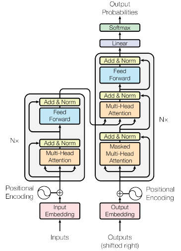

*Figure 1. Transformer Vaswani et al. (2017)*

Positional encoding is important for handling sequence data, as stated in Giuliari et al., 2021. Traditional transformers
utilize positional encoding to provide the model with information about word positions since they lack recurrence or
convolution operationsVaswani et al. (2017). The EQ. 1 uses sin frequency to calculate the positional encoding of the
even positions pos being the position, 2i the dimension, and dmodel being the embedding dimension. Similarly, the
odd positions use the cosine frequency in Eq. 2. The positional encoding is added element-wise to the embeddings.
In the context of TP, positional encoding incorporates temporal information, and the transformer model encodes time
for each past and future time instance using positional encoding. This positional encoding ensures that each input
embedding is timestamped with its corresponding position, allowing the model to understand the temporal sequence
of positions Giuliari et al. (2021).

*Equation 1*

$$ \text{PE}_{(pos, 2i)} = \sin\left(\frac{pos}{10000^{2i / d_{\text{model}}}}\right)$$

*Equation 2*

$$\text{PE}_{(pos, 2i + 1)} = \cos\left(\frac{pos}{10000^{2i / d_{\text{model}}}}\right)$$

According to Vaswani et al. (2017), additive attention and dot-product attention are the two main types of attention
mechanisms. Scaled dot product attention has an input that consists of keys of dimension dk and keys found in EQ. 3.
A set of key-value pairs and a query is mapped to an output, where each element is a vector. The output is a weighted
sum of the values, with weights determined by the compatibility of the query with the keys. Scaled Dot-Product
Attention is a specific attention mechanism and dimension value. The query with all keys is computed using a dot
product and passed through a softmax function to get the weights on the values.

*Equation 3*

$$\text{Attention}(Q, K, V) = \text{softmax}\left(\frac{QK^T}{\sqrt{d_k}}\right) V $$

*Equation 4*

$$\text{MultiHead}(Q, K, V) = \text{Concat}(\text{head}_1, \text{head}_2, \ldots, \text{head}_h)W^O \\
                \text{head}_i = \text{Attention}(QW_i^Q, KW_i^K, VW_i^V)$$

Multi-head attention found in EQ. 4 enhances performance by projecting queries, keys, and values linearly in dimensions, respectively. Each projection is processed in parallel, and the results are concatenated and linearly projected.
This design maintains computational costs similar to single-head attention while allowing the model to attend to
different representation subspaces.

### Spatial-Temporal Graph Transformer
The Spatio-Temporal Graph Transformer (STAR) framework extends Transformers to structured data sequences,
particularly graph sequences, making them suitable for TP tasks. The spatial-temporal graph transformer found in
Fig. 2is designed to model complex interactions in spatio-temporal data. It uses the principles behind GNNs with
the transformer architecture to capture spatial and temporal dependencies in the data. The Transformer utilizes a
graph-based data representation, where nodes represent entities while edges represent either relationships, interac-
tions between them, or distances. STAR approaches attention modeling first by focusing on temporal and spatial
dynamics separately. The Temporal Transformer takes the Cartesian coordinates representing the agents’ positions,
while the spatial Transformer TGConv handles the relations between agents. The outputs are then combined to be
processed through an additional spatial and temporal encoder. Yu et al. (2020) incorporated a message-passing be-
tween temporal encoders called graph memory, which passes past embeddings to the initial temporal encoder. The
outputs of this final encoder are passed through a fully connected layer for the predictions. The predictions are then
used in the input embeddings of the next frame.

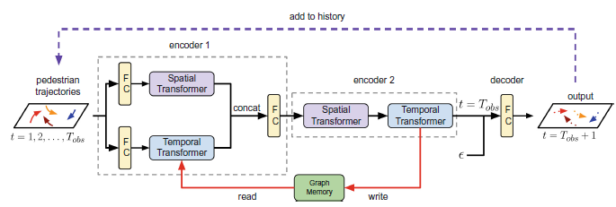

*Figure 2. Spatial-Temporal Graph Transformer Yu et al. (2020)*

## Related Work
This section covers extensive research concerning TP, a critical domain in developing intelligent transportation sys-
tems and autonomous navigation. TP involves forecasting the future paths of various agents, including pedestrians,
vehicles, and robots, within dynamic and complex environments. Accurate TP is essential for various applications,
including urban planning, autonomous driving, and crowd management, as it ensures safety, efficiency, and smooth
interactions among different agents. The literature on TP encompasses pedestrian trajectory prediction, vehicle trajectory prediction, and multi-agent trajectory prediction, each addressing unique challenges and employing diverse methodologies to achieve accurate predictions. By reviewing the related work in these areas, this section aims to pro-
vide a comprehensive understanding of the SOTA methodologies and their advancements in addressing the challenges
of trajectory prediction in various contexts.

### Pedestrian Trajectory Prediction
This section delves into the existing body of research on pedestrian TP, a critical area in developing intelligent
transportation systems and autonomous navigation. Pedestrian TP is inherently more complex than vehicle TP due
to pedestrian movement’s dynamic nature and flexibility. While vehicular movement is more constricted due to
physics and traffic laws, a vehicle cannot turn on a dime with laws preventing specific actions. On the other hand, a
pedestrian can change directions at any moment. Additionally, many aspects can influence a pedestrian’s movements,
be it acceleration or deceleration to avoid a collision, walking in groups, and other intricate interactions, making these
interactions essential in predicting their movement.

To address the challenges with the LSTM model’s ability to capture relative relations and spatio-temporal informa-
tion effectively. Yutao et al. (2021) proposed a Social Graph Convolutional LSTM (SGC-LSTM) model to capture
the characteristics of pedestrian movement and incorporate the information into the model to predict trajectories.
The model structure is based on a sequence-to-sequence architecture, comprising an LSTM encoder layer to process
pedestrian trajectory history and an LSTM decoder layer for final output. A middle layer includes an LSTM hidden
state and a GCN layer concatenated with the encoder’s output in a residual layer fashion. Element-wise multiplica-
tion, termed an emotion gate, combines these outputs before passing them to the decoder. The number of networks
scales with the pedestrian count, with LSTM handling movement and GCN modeling social interactions. A global
self-attention module constructs the edges from the GCN. C. Yang and Pei (2023) proposed a Long-Short Term
Spatio-Temporal Aggregator (LSSTA) using a spatial encoder module capturing dynamic spatial dependencies us-
ing a combination of GCNs and spatial Transformer. A long-short temporal encoder utilizes a transformer to encode
pedestrian motion patterns, capturing long-term temporal dependencies. Additionally, a conditioned variational auto-
encoder generates informative latent variables for improved predictions. Temporal convolutional networks (TCN) di-
rectly aggregate spatial and temporal interactions, enhancing prediction accuracy. The scene and future information
are integrated using a decoder module, allowing for multi-modal prediction.

While early methods focused on RNNs and later incorporated attention mechanisms, recent approaches have lever-
aged graph structures to represent pedestrian interactions. However, existing methods overlook complex social factors
like relative speed and perspective. To address these limitations, Lv et al. (2023) proposed the Social Soft Attention
Graph Convolution Network (SSAGCN), which integrates social factors and scene information using a sequential
scene attention-sharing mechanism. This approach improves TP accuracy by considering continuous scene influence
and diverse social interactions. Trajectory generation involves using TCNs to model the temporal dependence of
social graph sequences and predict future coordinates based on a Gaussian distribution. The model is trained using
a negative log-likelihood loss function, comparing the predicted parameters of the Gaussian distribution with the
ground-truth values of pedestrian coordinates. Y. Li et al. (2022)

Deep learning models, including LSTM, GAN, and GCN, have been applied to pedestrian TP, with advancements
such as Social-LSTM and Social-GAN improving accuracy. However, Z. Yang et al. (2023) argues that real-time per-
formance remains an issue for autonomous driving as the computational demands of these models are too costly. A
novel TP model, Attention View Direction GCN (AT-VD-GCN), is proposed to address the limitations of overlooking
timing change information and redundant data, integrating prior awareness, information fusion, and spatial interac-
tion modes to improve accuracy and reduce redundancy. The model uses view-direction graphs based on the field
of view to model pedestrian interactions. Sun et al. (2019) also wanted to improve computational efficiency argued
that, GCNs are designed to process signals defined on graph domains, offering computational efficiency through lo-
calized filters and spectral graph approximations. TCNs, on the other hand, perform convolutional operations across
the temporal dimension, demonstrating effectiveness in tasks like action analysis and recognition. The authors draw
inspiration from these architectures, proposing NodeTCN and EdgeTCN modules within the Spatial-temporal Atten-
tion Graph Convolutional Network (SAGCN) framework for human TP. The framework is primarily motivated by
pedestrians’ tendency to observe certain relative motion patterns. The SAGCN model comprises three main modules:
NodeTCN, EdgeTCN, and GCN. The NodeTCN module extracts temporal features from individual trajectories using
TCN. The EdgeTCN module evaluates the influence of one pedestrian on another based on their relative motions,
generating an attention matrix. Finally, the GCN module performs graph learning on the attention graph to predict
future trajectories. Through experiments on ETH and UCY datasets encompassing various social behaviors, SAGCN demonstrates superior performance over five baseline models in ADE and FDE.

Existing models, such as RNN-based and Transformer-based approaches, excel in capturing temporal correlations
but suffer from drawbacks like long inference times and high memory consumption. In contrast, Gated Linear Units
(GLU) present a practical alternative with a lightweight CNN-based structure, offering efficiency and faster predic-
tions without iterative processing. Addressing the need for accurate predictions, Liu et al., 2022 developed STHGLU
model leverages human-human and human-scene interactions to model pedestrian behavior effectively. By incorporating physical features and sequential local heatmaps, STHGLU captures spatial-temporal correlations and scene
impact, resulting in improved prediction accuracy and inference speed. The key contributions include introducing
GLU to TP, proposing an adaptive GCN for modeling interactions, and modeling sequential local heatmaps to un-
derstand scene dynamics and predict future positions accurately. The Spatial-Temporal module captures interactions
between pedestrians, using relative positions as inputs, which are then embedded and used for correlation modeling.
An adaptive GCN is proposed to model these interactions, utilizing physical features such as relative distance and
bearing angle to determine heterogeneous attention among pedestrians. The adaptive adjacency matrix is constructed
based on symmetric and asymmetric components derived from physical features, enabling effective interaction mod-
eling. The Heatmap module utilizes global and local scene heatmaps extracted from training data to understand scene
impact. The global heatmap is constructed statistically from training trajectories, while the local heatmap around each
pedestrian is obtained during inference. GLU is employed for temporal modeling, capturing temporal correlations
efficiently.

The long-term TP challenge is the diminishing relevance of maneuver patterns over time in existing models. To
tackle this, Singh and Srivastava (2022) proposed pre-processing to emphasize patterns before inputting them into
the encoder. This pre-processing includes utilizing Graph Temporal Convolution layers to extract spatial and temporal
features, generating graphs representing inter-agent interactions, and applying spatial sampling for feature extraction.
The model architecture consists of Batch Normalization, spatial-temporal blocks, feature fusion, and a TP module.
Graphs are generated for each frame, with nodes representing objects and edges denoting connections based on dis-
tance thresholds. The adjacency matrix is used for graph representation, facilitating Fourier transform and spatial
graph convolution for feature extraction. Temporal features are extracted using Graph Temporal Convolution layers,
incorporating interaction among objects based on adjacency matrices. Feature fusion and path fusion modules aggre-
gate features for robust representation. Finally, a TP model, employing an LSTM-based Encoder-Decoder network,
predicts future coordinates based on extracted features. 

Zhou et al. (2021) developed a model Attention-based interaction-aware Spatio-Temporal GNN (AST-GNN) is pro-
posed. AST-GNN comprises spatial and temporal graph neural network modules (S-GNN and T-GNN) leveraging
graph attention mechanisms to capture spatial and temporal interactions effectively. AST-GNN model for pedes-
trian TP, comprising an encoder-decoder structure. The encoder incorporates two modules: an attention-based spa-
tial graph for spatial interactions and an attention-based temporal graph for temporal interactions. The decoder, a
TXP-CNN prediction model, forecasts future trajectories. ETH and UCY datasets experiments demonstrated that it
improved pedestrian TP, achieving SOTA performance. Overall, AST-GNN offers a promising approach to tackling
the complexities of pedestrian TP in crowd scenes. Another approach based on GNNs was Zhu et al., 2023 who
introduced Triple Hierarchical GNN (Tri-HGNN) for pedestrian TP, aiming to capture intrinsic and extrinsic factors
influencing pedestrian behavior. Unlike previous methods, Tri-HGNN fuses interaction features with intermediate
destinations, enhancing the influence of intrinsic interactions on pedestrian intention. The model was evaluated on
ETH, UCY, and SDD datasets, demonstrating its effectiveness over SOTA methods.

According to X. Chen et al. (2021) various types of attention mechanisms, including global attention, local atten-
tion, and self-attention, have been explored, with recent models leveraging self-attention to achieve promising results
based on current interactions rather than historical trajectories. These advancements collectively enhance TP models,
making them more efficient and effective in real-world scenarios. The model architecture encompasses three key
components: the spatial and temporal encoder, the attention mechanism, and the self-centered star graph decoder.
Initially, historical trajectories of the target pedestrian and neighboring pedestrians are encoded separately to capture
temporal and spatial information using Long Short-Term Memory Networks (LSTM). Subsequently, the attention
mechanism simulates pedestrian attention by allocating weights to different pedestrians based on relevance, employ-
ing multi-head personalized attention for robust feature extraction. The self-centered star graph decoder simplifies
the graph structure to reduce computational complexity while maintaining effectiveness, utilizing LSTM layers to
decode spatial and temporal information and calculate attention between pedestrians. Ultimately, the model predicts
pedestrian trajectories accurately by generating predicted locations based on attention scores.

TCNs have gained popularity in sequence prediction tasks, offering advantages over autoregressive models by avoidng error accumulation. These networks have been applied to diverse domains, such as analyzing student engagement
in online courses and predicting stock trends by incorporating background knowledge. According to Y. Wang et al.
(2021), combining these techniques holds great potential for improving the accuracy and robustness of pedestrian
TP systems. In the context of pedestrian TP, social interactions among pedestrians play a crucial role in influencing
future paths, necessitating the representation of these interactions in TP models. A graph representation is introduced
to address this, where pedestrians are nodes and social interactions are edges. The model comprises two main com-
ponents: an STGCNN and a stacked TCN. In the STGCNN, essential features are extracted by combining spatial
graph convolution and temporal convolution, facilitated by the computation of edge values based on node distances.
This network captures both spatial and temporal dependencies in observed trajectories. The stacked TCN consists of
convolutional layers connected by residual blocks, aiming to predict future trajectories.

Z. Li et al. (2020) introduces an Anomaly Attention Module (AAM) that considers both positions and anomaly
salience to better capture the importance of neighboring objects. The proposed model addresses the challenges of
human TP in dynamic scenarios by introducing two key modules: Diversity-Aware Memory (DAM) and Anomaly At-
tention Module (AAM). DAM effectively handles the diversity of trajectory segments, segmenting them into straight
and detouring segments based on a detour integral criterion and leveraging separate sub-modules to extract dynamics
from each segment type before fusing them for accurate prediction. On the other hand, AAM enhances spatial edge
modeling by incorporating anomaly salience and capturing unexpected movements and events to augment spatial
relation information. The overall model architecture follows a spatial-temporal graph paradigm, integrating temporal
and spatial information using a soft attention mechanism. Trained using LSTM networks the model demonstrates im-
proved accuracy and efficiency in predicting human trajectories in complex, crowded environments, thereby offering
a promising solution for real-world applications.

Transformer networks have become highly successful in Natural Language Processing (NLP), employing an encoder-
decoder structure similar to RNNs seq2seq models. The core concept of Transformers revolves around replacing
recurrence with a multi-head self-attention mechanism. This mechanism enables the model to learn temporal de-
pendencies across long time horizons by computing self-attention between embeddings across different time steps.
MHA allows the model to attend to information from different representations and positions jointly. Transformers
also incorporate additional positional encoding to provide positional information to embeddings, enhancing their
performanceYu et al. (2020). Prior approaches utilizing generative models like GANs and CVAEs struggle with
biases and distributional deviations, while graph-based methods encounter over-smoothing issues that compromise
unique behavioral characteristics. Addressing these challenges, a novel framework, STGlow, is proposed by Liang
et al. (2023), integrating a generative flow framework with pattern normalization for precise distribution modeling
and a Dual-Graformer to capture social interactions effectively. By simulating the evolution of human motion behav-
iors and leveraging graph structures with transformers, STGlow achieves superior TP accuracy, marking significant
advancements in the field.

Pedestrian TP is vital for intelligent transportation systems and autonomous navigation due to pedestrian move-
ments’ unpredictable and flexible nature. Research has advanced from basic LSTM networks to sophisticated models
integrating social interactions and spatial-temporal dependencies. Notable advancements include the SGC-LSTM,
which combines LSTM and GCNs to improve prediction accuracy, and the LSSTA, which uses spatial encoders and
temporal transformers for dynamic dependency capture. The Triple GNN addresses complex interactions among
pedestrians, scenes, and objects, enhancing TP accuracy. The SSAGCN improves accuracy with attention mecha-
nisms and TCNs. The AT-VD-GCN optimizes computational efficiency and reduces redundancy, while the STHGLU
Model incorporates GLU and adaptive GCNs for efficient temporal modeling. AST-GNN uses graph attention mech-
anisms to capture spatial and temporal interactions, achieving SOTA performance. These advancements highlight the
importance of modeling social interactions, enhancing real-time performance, and capturing long-term dependencies
for more accurate and efficient pedestrian TP systems.

### Vehicle Trajectory Prediction
This section reviews the existing literature and previous research on vehicular TP. Predicting vehicle movements
has garnered significant attention in recent years, driven by advancements in autonomous driving technologies and
the increasing availability of vehicular data. Various methodologies have been proposed, from classical statistical
approaches to modern machine learning and deep learning techniques. Recently, there has been a notable surge in
research focused on understanding the interactions among vehicles, particularly with the advancement of autonomous
driving technology. These interactions, defined as situations where the behaviors of vehicles are mutually influenced when their distance falls below a certain threshold, are crucial for ensuring both efficiency and safety in complex
traffic environments. Failure to properly account for vehicle interactions can lead to reduced traffic flow efficiency,
congestion, and even fatal accidents, as evidenced by incidents involving autonomous vehicles.

Researchers have proposed various approaches to extracting and representing vehicle interaction information to ad-
dress this. However, existing methods often overlook shared information between interactions across different sce-
narios, limiting their applicability and effectiveness. To address these issues, Ye et al. (2022) proposed a unique
approach called the Graph Self-Attention Network (GSAN) with a pre-training and fine-tuning framework. GSAN
leverages the graph attention network to model dynamic vehicle interactions and incorporates interaction informa-
tion into lane-changing classification and TP tasks. The proposed model, GSAN, consists of an embedding layer,
a graph self-attention layer, and a Gated Recurrent Unit (GRU) layer to capture interaction information. The graph
construction involves dynamic, weighted, directed graphs representing intervehicle interactions over time. GSAN’s
architecture includes position-wise, fully connected feed-forward and normalization layers and a GRU layer to em-
bed spatial and temporal information. Pre-training GSAN with trajectory auto-regression is proposed to capture
interaction effects from unlabeled data before addressing downstream tasks. This approach leverages large datasets
of vehicle trajectories to learn interaction representations effectively. The article discusses two adaptation schemes
for fine-tuning the pre-trained GSAN model to address various downstream tasks in autonomous driving scenarios.
Adaptation Scheme 1 involves fitting a task-specific output layer directly onto the pre-trained GSAN, which is suit-
able for basic tasks requiring only spatial-temporal information. Adaptation Scheme 2 integrates GSAN with existing
models for more complex tasks by adding a mapping layer to bridge the dimension gap between GSAN’s output and
the downstream model’s input.

Azadani and Boukerche (2023) argued that previous methods for vehicular TP often failed to consider the spatial
and temporal interactions among surrounding agents and the target vehicle, leading to inaccurate predictions. Spatio-
Temporal Attention Graphs (STAG) address this challenge by creating directed spatio-temporal graphs to model
the dynamic social correlations between the target vehicle and its surrounding agents. It utilizes attention-based
mask blocks to learn asymmetric interactions, capturing the varying influence strengths among different agents.
The model extracts path representations using GCN and generates future paths with TCN, effectively considering
spatial inter-agent correlations and motion tendencies while managing interaction strengths. Evaluation on various
driving scenarios demonstrates STAG’s superiority, achieving SOTA results and showcasing its transferability and
generalization capabilities.

While various approaches to TP exist, many need help accurately account for inter-object interactions and dynamic
scene dynamics. An et al. (2022) introduces a novel Dynamic Graph-based Interaction-aware network (DGInet) to
address these challenges. The proposed model considers interactive vehicle influences and dynamic scene graphs to
improve prediction accuracy and computational efficiency. DGInet effectively processes three-dimensional tensors
with temporal and spatial dependencies and handles large adjacency matrices more efficiently. The input processing
cell prepares raw trajectory data for the model, constructing adjacency tensors for vehicle interactions. SGGCN fo-
cuses on spatial interaction using fixed and trainable graphs, while MGCN extends graph networks to leverage the
multidimensional structure of traffic data. The algorithm combines embeddings generated by SGGCN and MGCN
for input to the encoder-decoder network, which predicts future trajectories using two-layer GRU networks. The
approach integrates various techniques to efficiently process and predict vehicle trajectories in complex traffic sce-
narios. Experimental results on public datasets demonstrate the superiority of DGInet over existing benchmark
models, confirming its effectiveness in real-world traffic scenarios.

Sheng et al. (2022) presents a method called Graph-based Spatial-Temporal Convolutional Network (GSTCN) for
predicting future trajectories of nearby vehicles. The approach simultaneously predicts trajectories for all neighboring
vehicles, providing detailed insights into future traffic scenarios. GSTCN consists of three main components: a spatial
graph convolutional module, a temporal dependency extractor, and a TP module. The spatial graph convolutional
module captures spatial dependencies among vehicles using a graph-based approach, while the temporal dependency
extractor extracts temporal patterns. These components feed into a TP module based on a GRU network, which
generates future trajectory distributions. The proposed method efficiently predicts future trajectories and outperforms
existing techniques regarding accuracy and computation time.

J. Chen et al. (2021) proposed representing TPs as bi-variate Gaussian distributions and trained a model to predict the
parameters of these distributions, leveraging insights from prior research in the field. The proposed model architecture
comprises three main components: the Vehicle Attention Function (VA), the Spatio-Temporal GCN (ST-GCNN), and
the TXP-CNN. The Vehicle Attention Function aims to capture the dynamic spatial influence between vehicles by
constructing a spatial graph using attention mechanisms to model social interactions among vehicles. The ST-GCNN introduces spatial convolution operations to the graph representation of vehicle motion trajectories, enhancing the
network’s robustness by normalizing the adjacency matrix. Meanwhile, the TXP-CNN extends the graph-embedded
features from the ST-GCNN over the time dimension to predict future vehicle trajectories.

Vehicular TP highlights its critical role in autonomous driving and the complexity of accurately forecasting vehicle
movements. Traditional methods often must capture the nuanced vehicle interactions, leading to inaccuracies. In-
novative models have been developed to address these challenges, such as the GSAN, which uses GATs and GRU
to model dynamic vehicle interactions. Another approach, STAG, employs attention mechanisms to model social
correlations between vehicles, achieving superior results in various driving scenarios. The DGInet processes tem-
poral and spatial dependencies more efficiently, improving prediction accuracy. The Graph-based Spatial-Temporal
Convolutional Network (GSTCN) simultaneously predicts trajectories for all nearby vehicles, enhancing accuracy
and computational efficiency. Additionally, a bi-variate Gaussian distributions model incorporates dynamic spatial
influences and spatio-temporal graph convolution to predict future vehicle movements. These advanced models sig-
nificantly improve the ability to capture vehicle interactions and predict trajectories in complex traffic environments,
contributing to safer and more efficient autonomous driving systems.

### Multi-class and Multi-Agent Trajectory Prediction
Multi-agent TP is a vital research area within the broader autonomous systems and intelligent transportation field.
This domain focuses on forecasting the future paths of multiple interacting agents within a shared environment, such
as pedestrians, vehicles, and robots. The complexity of this task arises from the need to model not only the individual
behaviors of agents but also their interactions and the dynamic context in which they operate. Predicting trajectories in
multi-agent settings is essential for various applications, including autonomous driving, drone navigation, and crowd
management. Accurate predictions enable these systems to anticipate potential collisions, plan safe and efficient
paths, and interact smoothly with human participants.

Robotic navigation in shared environments requires reliable systems for collision-free paths and efficient traversal
amidst crowds. Traditional obstacle avoidance methods often overlook dynamic human behavior, hindering effective
human-robot collaboration. Recent research focuses on pedestrian TP for better robot path planning, but compu-
tational complexity still needs to be improved. According to S.-H. Wang et al. (2023), research in this area falls
into three main categories: reaction-based, trajectory-based, and learning-based. Reaction-based approaches like
social force models and Velocity Obstacles determine collision-free paths but may overlook optimal trajectories.
Trajectory-based methods predict human behavior using past trajectories, improving robot navigation but facing
challenges in crowded scenarios. Learning-based methods, particularly Reinforcement Learning (RL), offer flexibil-
ity and efficiency but require careful consideration of the robot’s field of view and generalization capabilities. Deep
Reinforcement Learning (DRL) and pedestrian TP models like Social-STGCNN are integrated into crowd-aware
navigation, enhancing the robot’s decision-making process.

A unique approach called Macro Micro-Hierarchical Spatio-Temporal Attention (MMH-STA) is proposed by Sun
et al. (2023). This approach is composed of a macroscopic layer and a microscopic layer, incorporating MHA for
encoding macro-historical state information and a transformer encoder along with a heterogeneous graph attention
network (HAMON) for modeling micro-historical state information and spatial interactions among agents, respec-
tively. The proposed MMH-STA approach demonstrates improved performance in multi-agent TP, particularly in
roundabout scenarios, compared to existing baselines, with rationality confirmed through ablation experiments. Key
contributions include introducing the concepts of macro-state and micro-state for agents within roundabout scenar-
ios, designing a directed heterogeneous graph to represent spatial interactions, and developing HAMON to fuse
multi-agent interactions in different orders of neighborhoods adaptively. The attention mechanism is applied for en-
coding both temporal and spatial features, with the MHA mechanism used for encoding macro-temporal features and
micro-temporal features separately, thus improving the efficiency and effectiveness of the model in predicting future
trajectories.

Social-STGCNN approach has leveraged GNNs to model pedestrian interactions, improving TP accuracy. Despite
challenges such as unsupervised learning methods, ongoing research in this domain continues to advance, aiming to
provide safer and more intelligent navigation systems through innovative deep learning-based solutions. Sighencea
et al. (2023) proposed an estimation method to forecast future trajectories for multiple interacting agents based
on their position history and contextual information, with potential extension to multi-target tracking frameworks.
Compared to previous approaches like social-STGCNN, adjustments in the dimensions of CNN modules have been made to enhance accuracy. The method comprises two main components: the spatio-temporal graph convolutional
neural network (ST-GCNN) and the TXP-CNN. The graph representation of pedestrian trajectories captures spatial
interactions, with nodes representing pedestrian positions and edges indicating interactions. The ST-GCNN extracts
spatio-temporal embeddings from input graphs, followed by normalization and convolution operations using Lapla-
cian matrices. The TXP-CNN operates on the temporal dimension of the graph embedding, utilizing feature space
convolutions to predict future locations. The algorithm for pedestrian TP encompasses these processes, leveraging
temporal convolution networks for efficient learning of time dependencies. The proposed method undergoes evalua-
tion on traditional datasets like ETH and UCY, alongside the more challenging SDD dataset, all of which feature real-
world scenarios with annotated trajectories representing social interactions and pedestrian behaviors. These datasets
encompass various scenes, including pedestrian-heavy environments like university campuses and city streets, with
annotations detailing classes such as vehicles and pedestrians.

Recent efforts have addressed multi-class TP by utilizing VAE and attention modules. However, these models over-
look important class data that could enhance TP accuracy. Existing models often focus on single-class TP, limit-
ing their applicability to scenarios involving multiple classes of road users. The Rainbow et al. (2021) proposed
Semantics-STGCNN, a spatial-temporal GCN incorporating class labels into the adjacency matrix to inform predic-
tions to address this limitation. This insight is implemented through a Semantics-guided graph Adjacency Matrix
(SAM), which combines label-level and velocity-based matrices to capture important correlations based on object
class. The proposed framework utilizes a Spatial-Temporal GCN (ST-GCNN) and a TXP-CNN to model trajectory
dependencies and estimate future distributions. By embedding class labels into the adjacency matrix and leveraging
both label-level and velocity-based matrices, the model incorporates important class information to inform predic-
tions. This approach improves TP accuracy and provides a more realistic representation of real-world scenarios
involving interactions between multiple classes of objects. 

To combat these issues Y. Wu et al. (2023) adopt a This article proposes MSIF, a multi-stream information fusion
approach, to address TP challenges in low-light conditions by considering vehicle interaction. MSIF leverages CNN
and LSTM layers for image feature extraction and scene understanding, while ST-GCN captures interactivity in the
optical flow and trajectory channels. The TP Module (TPM) integrates features and predicts trajectories. The Dark-
HEV-I dataset simulates low-light conditions for validation alongside the HEV-I dataset. Comparative experiments
show that MSIF outperforms baselines in TP metrics. Feature fusion analysis confirms the effective integration of
heterogeneous data. Qualitative analysis demonstrates realistic predictions in complex scenarios, indicating adapta-
tion to low-light environments and scene understanding. The method applies to intelligent networked vehicle driving
and can extend to roadside applications. Future work includes exploring richer perception data and novel architec-
tures like graph-based neural networks and developing lightweight TP networks for real-time autonomous driving in
low-light scenarios.

Multi-agent TP is essential in autonomous systems and intelligent transportation, focusing on forecasting the future
paths of interacting agents like pedestrians, vehicles, and robots. This task’s complexity arises from modeling individ-
ual behaviors, interactions, and dynamic contexts, which are crucial for autonomous driving, drone navigation, and
crowd management applications. Traditional methods often overlook dynamic human behavior, but recent research
offers improvements through reaction-based, trajectory-based, and learning-based approaches, with RL and Deep RL
enhancing flexibility. Innovative models like MMH-STA and Semantics-STGCNN incorporate macroscopic and mi-
croscopic state information and class labels to improve prediction accuracy. The MSIF method addresses low-light
TP challenges by combining CNN, LSTM, and ST-GCN for comprehensive scene understanding and interactivity
capture, demonstrating superior performance in complex scenarios and adaptability for real-time autonomous driv-
ing. Future research aims to enhance perception data integration, explore new architectures, and develop lightweight
TP networks for improved real-time applications.

### Environmental Infrastructure Infused Trajectory Prediction
TP in urban environments is a complex task that requires understanding the movement patterns of agents, such as
vehicles and pedestrians, within a dynamic and often congested infrastructure. Traditional TP models primarily focus
on the agents themselves, sometimes neglecting the crucial role environmental infrastructure—such as roads, traffic
signals, sidewalks, and other urban elements—influences movement behaviors. Environmental infrastructure-infused
TP aims to bridge this gap by integrating detailed environmental context into predictive models. By considering
the static and dynamic elements of the urban landscape, these models can more accurately forecast agents’ future
positions.

Zhang et al. (2022) proposed the Gatformer, which combines GATs and Transformer architecture to model interac-
tions among traffic agents and infrastructure using sparse graphs. By considering historical observations and spatial-
temporal interactions, the Gatformer aims to predict future trajectories accurately. The proposed method is evaluated
using the Lyft dataset, which incorporates various rasterized representations of road infrastructure. The Gatformer
model integrated a GAT block with a Transformer Encoder-Decoder architecture. Input traffic scenarios are trans-
formed into traffic graphs, with nodes representing agents and edges indicating interactions. Spatial and temporal
features are extracted and processed using CNNs, concatenating them for input. The GAT block employs attention
mechanisms to capture important agent interactions, utilizing Multi-Head Attention and residual connections for sta-
bility and performance enhancement. The Transformer Encoder captures global dependencies, while the Decoder
predicts future velocities iteratively, leveraging residual connections and a linear transformation for accuracy.

S. Wu et al., 2022 addresses the challenge of predicting future trajectories of surrounding agents in complex traffic
scenarios for autonomous vehicles, where considering only current environmental information may lead to collision
risks. Traditional methods rely on raster-based approaches utilizing CNNs for representation, but they introduce
invalid information and suffer from resolution limitations. Recent works have focused on learning context directly
from graph representations based on High-Definition (HD) maps, utilizing GCNs to model interactions among road
components and agent trajectories. However, differences exist in how graph nodes are represented and message pass-
ing is conducted. This study proposes an adaptive temporal feature encoder and a dual spatial feature encoder within
a graph-based interaction-aware framework for motion forecasting. The adaptive encoder extracts temporal motion
features with attention mechanisms, while the dual spatial encoder combines road connectivity and graph attention
to model interactions among lanes in HD maps. The architecture consists of four main components: the map encoder
constructs a graph from HD maps, the agent encoder extracts features from historical trajectories using an adaptive
temporal encoder, the dual spatial encoder models interactions among lane nodes using road connectivity and graph
attention, and the interactions and TP module utilizes a multi-head attention mechanism and a pyramid decoder to
predict future trajectories. The method employs an adaptive temporal feature encoder for gathering temporal fea-
tures and a dual spatial feature encoder to capture complex interactions among lane nodes. Additionally, agent-map
and agent-agent interactions are modeled using separate fully-connected graphs, and a pyramid decoder generates
multi-modal future trajectories.

Gao et al. (2020) proposed an approach known as VectorNet, which begins by representing agent trajectories and HD
maps as sequences of vectors. For the environmental infrastructure lanes and intersections in addition to agent trajectories, key points are sampled and connected to form vectors. These vectors form polylines that closely approximate
the original map and trajectory data. Each vector in a polyline is treated as a node in a graph, with node features
including coordinates, attributes, and polyline identifiers. This graph representation enables encoding by GNNs.
The method constructs subgraphs at the vector level, connecting all vector nodes of a polyline. Node features are
transformed, aggregated, and relationally encoded using a Multi-Layer Perceptron (MLP) and maxpooling. The sub-
graph network aggregates local information within polylines. The polyline node features are processed by a global
interaction graph to model high-order interactions. This is implemented using a self-attention mechanism within a
GNN. The network can model interactions across different trajectories and map polylines. Future trajectories are
decoded from the node features of moving agents using an MLP. More advanced decoders can also generate diverse
trajectories.

Huang et al. (2022) suggests that challenges persist in modeling complex interactions in natural scenes, necessitating
the incorporation of semantic information and comprehensive modeling of interactions among pedestrians, scenes,
and objects. The proposed Triple GNN model is introduced to address these challenges, aiming to exploit mutual
relations among pedestrians, scenes, and objects. It employs a two-stage optimization strategy with GNN to aggre-
gate spatial interactions and a compact temporal convolutional network to capture temporal dependencies. It offers
a solution suitable for scenarios with complex interactions among pedestrians, scenes, and objects in pedestrian TP.
The study addresses the challenge of predicting future pedestrian trajectories in video sequences, where the move-
ments are influenced by surrounding scenes and objects. Their proposed Triple GNN framework comprises three key
modules: Triple Feature Extraction, which gathers trajectory, scene, and object features for each pedestrian; S-GNN
with Two-stage Scheme, constructing a spatiotemporal graph to capture interactions among pedestrians, scenes, and
objects, utilizing a two-stage optimization model to adjust interaction weights adaptively; and TCN with Dilated
Convolution, which models temporal dependencies through a temporal convolutional network to predict future tra-
jectory coordinates. By comprehensively modeling these interactions, the framework aims to enhance the accuracy
of TP, particularly in complex scenarios where multiple factors influence pedestrian movement, thereby contributing
to advancements in computer vision-based applications like unmanned vehicles, surveillance systems, and service
robots.

Trajectory Prediction (TP) in urban environments is complex, requiring models to understand the movement patterns
of agents like vehicles and pedestrians within a dynamic infrastructure. Traditional TP models often overlook the
significant influence of environmental infrastructure—such as roads, traffic signals, and sidewalks—on movement
behaviors. Integrating this context, environmental infrastructure-infused TP aims to enhance prediction accuracy
by considering both static and dynamic urban elements. Zhang et al. (2022) proposed the Gatformer, which uses
Graph Attention Networks (GATs) and Transformer architecture to model interactions among traffic agents and
infrastructure using sparse graphs, evaluated with the Lyft dataset. S. Wu et al., 2022 addressed the challenge of
forecasting future agent trajectories in complex traffic scenarios by proposing an adaptive temporal feature encoder
and dual spatial feature encoder within a graph-based framework. This approach models interactions among lanes and
uses a multi-head attention mechanism and pyramid decoder for accurate predictions. Gao et al. (2020) introduced
VectorNet, representing agent trajectories and high-definition maps as sequences of vectors, enabling graph-based
encoding and interaction modeling. This method constructs subgraphs to aggregate local information and uses a
global interaction graph for high-order interactions, improving TP accuracy by decoding future trajectories from
moving agents’ node features.

*Table 1*

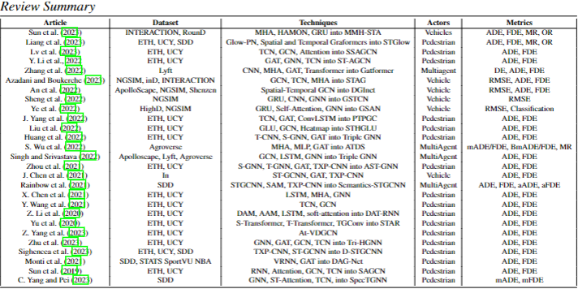

### Analysis
Recent advancements in TP have introduced several innovative approaches, particularly leveraging spatial and tem-
poral block architectures. As summarized in Table 2, these approaches employ various deep learning techniques,
including LSTM networks, GCNs, TCNs, TXP-CNNs, and Transformer networks. Each of these techniques offers
unique strengths to tackle the complexities of TP. LSTMs are particularly adept at capturing long-term dependencies
in sequential data, making them suitable for modeling the temporal dynamics of pedestrian movements. They are
commonly employed in sequence-to-sequence architectures to process trajectory history and predict future move-
ments. GCNs excel in modeling spatial interactions among multiple agents by representing pedestrians and their
interactions as a graph. This capability is crucial for understanding how individuals influence each other’s move-
ments in crowded environments, thereby capturing complex social dynamics and spatial dependencies. TCNs offer
advantages in sequence prediction tasks by performing convolutional operations across the temporal dimension,
avoiding the error accumulation inherent in autoregressive models. This makes them effective for capturing temporal
dependencies more stably. TXP-CNNs combine CNNs’ strengths with temporal processing capabilities. They extract
spatiotemporal embeddings from input data to facilitate accurate trajectory predictions. By considering both spatial
interactions and temporal evolution, TXP-CNNs enhance overall predictive performance. Transformer networks uti-
lize self-attention mechanisms to capture long-range dependencies across time steps. They effectively handle varying
sequence lengths and complex interaction patterns, enhancing prediction accuracy through their multi-head attention
mechanism. This allows the model to simultaneously focus on different parts of the input sequence. The performance
of these TP models is typically evaluated using metrics such as ADE and FDE. Some studies also employ RMSE and MSE to highlight model strengths. These metrics assess the models’ ability to predict future positions accurately. In
terms of datasets, the primary open-source benchmarks used for pedestrian TP include the ETH and UCY datasets.
These datasets feature real-world scenarios with annotated trajectories representing social interactions and pedestrian
behaviors. For vehicular TP, the datasets vary, but they often include comprehensive traffic scenarios with detailed
trajectory data.

Section 2.2.1 highlights the ongoing efforts to address challenges such as real-time performance issues and consider
complex social factors, with innovative solutions proposed, including novel model architectures like the SGC-LSTM
and AT-VD-GCN. LSTMs are particularly adept at capturing long-term dependencies in sequential data, making them
suitable for modeling the temporal dynamics of pedestrian movements. They are commonly used in sequence-to-
sequence architectures to process trajectory history and predict future movements. GCNs are effective for modeling
spatial interactions among multiple agents. GCNs can capture complex social dynamics and spatial dependencies by
representing pedestrians and their interactions as a graph. This is crucial for understanding how individuals influence
each other’s movements in crowded environments. TCNs offer advantages in sequence prediction tasks by avoiding
error accumulation inherent in autoregressive models. They perform convolutional operations across the temporal
dimension, which makes them effective for capturing temporal dependencies. TXP-CNNs combine the strengths of
CNNs with temporal processing capabilities. They extract spatiotemporal embeddings from input data, facilitating
accurate TPs by considering spatial interactions and temporal evolution. Transformers utilize self-attention mech-
anisms to capture long-range dependencies across time steps. They are particularly effective in handling varying
sequence lengths and complex interaction patterns. Attention mechanisms have emerged as a key component in
recent TP models, enhancing prediction accuracy by focusing on relevant interactions. Transformer networks also
play a significant role, enabling the capture of long-term dependencies and complex interactions. The multi-head
attention mechanism in Transformers allows the model to focus on different parts of the input sequence simultane-
ously, enhancing prediction accuracy. Continued innovation across various methodologies, including CNN-based
approaches, graph-based models, and transformer architectures, underscores the interdisciplinary nature of the field
and the ongoing quest for safer and more intelligent navigation systems through pedestrian TP research.

Section 2.2.2 reveals a field undergoing rapid advancement due to the demands of autonomous driving technology
and the availability of extensive vehicular data. Traditional statistical approaches have given way to sophisticated
machine learning and deep learning techniques that better account for the dynamic interactions between vehicles.
Central to recent progress are models like the GSAN and STAG, which emphasize the importance of accurately
modeling inter-vehicle interactions to enhance prediction accuracy. These models leverage graph-based and attention
mechanisms to capture complex spatial-temporal dependencies. Furthermore, DGInet and GSTCN demonstrate
improved computational efficiency and predictive accuracy by effectively integrating dynamic scene data and vehicle
interactions. Overall, the ongoing research highlights the importance of sophisticated interaction modeling and the
potential for pre-trained models to leverage large datasets, pushing the boundaries of vehicular TP towards safer and
more efficient autonomous driving systems.

Section 2.2.3 underscores the complexity and significance of accurately forecasting the future paths of multiple inter-
acting agents in shared environments. This field, crucial for applications like autonomous driving, drone navigation,
and crowd management, demands models that account for individual agent behaviors and interactions. Traditional
methods often fall short in dynamic settings, leading to a shift towards more sophisticated approaches leveraging
machine learning and deep learning. Techniques such as MMH-STA, Social-STGCNN, and Semantics-STGCNN
showcase advancements in modeling spatial and temporal dependencies, incorporating social interactions, and em-
bedding class information into prediction frameworks. Innovations like the DGInet and MSIF for low-light conditions
highlight ongoing efforts to enhance prediction accuracy and computational efficiency. These models demonstrate
improved performance in real-world scenarios, confirming their potential to revolutionize autonomous systems by
providing safer and more intelligent navigation solutions.

Section 2.2.4 highlights the necessity of incorporating environmental infrastructure into predictive models to en-
hance accuracy and reliability. Traditional TP approaches often neglect the impact of static and dynamic elements
like roads, traffic signals, and sidewalks on agents’ movements, leading to limitations in accurately forecasting fu-
ture positions. To address this, recent advancements emphasize integrating environmental context into TP models.
For instance, Zhang et al. (2022) proposed the Gatformer, which combines GATs and Transformer architecture to
model interactions among traffic agents and infrastructure, leveraging sparse graphs and historical data for precise
predictions. Similarly, S. Wu et al., 2022 introduced a graph-based framework featuring adaptive temporal and dual
spatial feature encoders to handle complex traffic scenarios, enhancing interaction modeling among lanes and agents
for accurate motion forecasting. Gao et al. (2020)’s VectorNet advanced this domain by representing agent trajec-
tories and HD maps as vector sequences, enabling graph-based encoding and modeling high-order interactions for improved TP. Lastly, Huang et al. (2022) presented the Triple GNN model to address the intricate interactions among
pedestrians, scenes, and objects in urban settings, using a two-stage optimization strategy and TCNs. These innova-
tive approaches collectively push the boundaries of TP accuracy in urban environments, making significant strides in
understanding and predicting complex agent behaviors within dynamic infrastructures.

Incorporating social interactions and scene information into TP models is crucial for enhancing prediction accuracy.
Social interactions are modeled by capturing how agents influence each other’s movements, often using graph-based
methods or attention mechanisms. Scene information, such as obstacles and pathways, is integrated to provide
context-aware predictions. This integration is essential for developing intelligent transportation systems, traffic man-
agement, and autonomous navigation technologies. Despite significant progress, there is a need for more research
on multi-class and multi-agent TP. These scenarios involve additional complexities, such as modeling interactions
among different types of agents and handling the increased computational load. Predicting the trajectories of multi-
ple agents simultaneously requires sophisticated models that can capture inter-agent dependencies and process large
amounts of data efficiently. The computational demands of advanced deep learning models can hinder inference
speed, critical for real-time applications like autonomous vehicles and robots. High computational costs can lead to
delays in decision-making processes, potentially resulting in collisions or other safety hazards. Therefore, optimizing
these models for efficiency without compromising accuracy is an ongoing challenge.

In conclusion, leveraging spatial and temporal block architectures in TP has significantly advanced the understanding
and prediction of human movements. Researchers have developed models that effectively capture the complexities
of pedestrian trajectories using LSTMs, GCNs, TCNs, TXP-CNNs, and Transformer networks. However, extending
these approaches to multi-class and multi-agent scenarios remains critical for future research, particularly optimizing
computational efficiency to ensure safe and reliable real-time applications. Additionally, there is a gap in research on
the node features of the spatial edges. Since spatial edges are separated into spatial blocks, little information about
what might be important is translated. Attention mechanisms currently rely solely on the weight of the edge, while
different classes of nodes may inherently have different weights. Addressing these gaps will be crucial in pushing
the boundaries of TP accuracy and application in complex, real-world scenarios.

## Method and implementation
This chapter provides an in-depth examination of the data collection process, the criteria for feature selection, and the
architectural framework underlying the experimental models. It offers a comprehensive elucidation of the method-
ologies employed in leveraging the gathered data and the intricate implementation of each model. Two primary
models were selected for implementation, while an additional will handle a baseline with no semantic information
and another will integrate the environmental infrastructure within the data. The Transformer model as it is model is
highly adaptable to variable-sized input sequence lengths and can handle unseen sequence lengths. This enables the
transformer model, unlike RNN models, to train in parallel rather than sequentially Giuliari et al. (2021). It has shown
excellent performance among SOTA models within the past three years. The second model is the Spatial-Temporal
Graph Transformer based on the implementation by Yu et al. (2020), with the Transformer acting as a baseline for
the ablation of study as the temporal Transformer is the basis for the Spatial-Temporal Graph Transformer. One
of the Transformer models will be the baseline without the semantic information, the second will contain semantic
information on the class of the traffic participant. The STAR transformer will have one model containing the spatial
information of only the agents as well as semantic information. This model will be the basis for the inclusion of
the environmental infrastructure for the Spatial Transformer on top of the spatial information on the other traffic
participants in the scene.

### Data
This section provides a comprehensive overview of the data collection and feature engineering processes tailored
specifically for multi-class TP. The dataset used in the experimental implementation is diverse, comprising a wide
range of participant trajectories annotated with multiple classes. The diversity of the dataset, capturing various
interactions and movements in real-world scenarios, was a crucial factor in enabling comprehensive model training
and evaluation.

The data was collected from two locations within the same four consecutive twenty-four-hour periods by Viscando
using a smart sensor camera from an eagle eye position. The coordinate system for Torpagatan is found in Fig. 3a; as
seen in the image, the grid pattern represents roughly ten-meter squares. The center location of the X and Y intersect,
from which the X is thirty meters in both the positive and negative; similarly, the Y is twenty meters. The coordinate
system for Valhallavägen is found in Fig. 3b, following the first coordinate system, the size being roughly thirty-eight
meters along the Y and roughly eleven meters along the X axis in both the positive and negative directions.

*Table 2*
*The Data representation of each type in both locations*
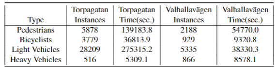

The traffic participants include pedestrians, bicyclists, light motor vehicles, and heavy motor vehicles. As found in
Table. 3 light vehicles had the highest representation in the data at Torpagatan, followed by pedestrians, bicyclists,
and heavy vehicles. Additionally, light motor vehicles had the most significant representation in seconds in the data,
followed by pedestrians, bicyclists, and heavy vehicles. Similarly, the second location saw the highest representation
of light motor vehicles, pedestrians following, bicyclists, and heavy motor vehicles. In contrast to the Torpagatan,
Valhallavägen saw a more significant representation of time for pedestrians, followed by light motor vehicles, bicyclists, and heavy motor vehicles with the least time representation. The data was anonymized to contain an ID based on the location over the period, an ID in the database, a Time Stamp, the coordinates of the traffic participant, velocity
vectors in m/s, the speed in km/h, type of participant, station that determines the tracker type, and if estimated.

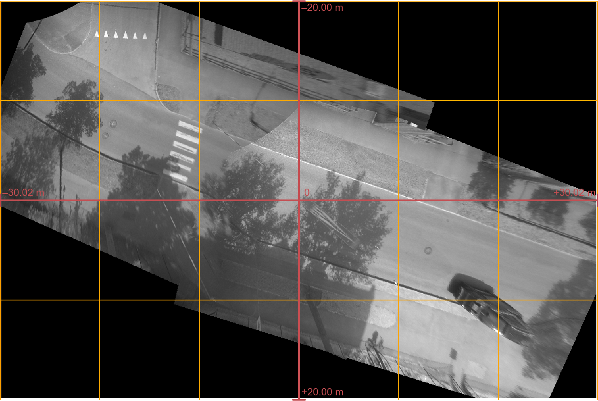
*(a) Coordinate System for Torpagatan*

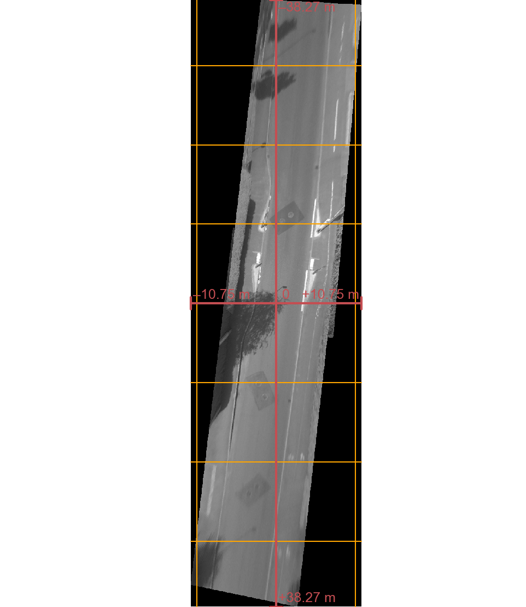
*(b) Coordinate System for Valhallavägen*

*Figure 3. Comparison of coordinate systems for two locations*

#### Feature Selection and Engineering

The trajectory data underwent extensive feature engineering to extract relevant information for multi-class TP. The
selected models are based on Transformer architecture. Thus, the selected features needed to be embedded before
forwarding through the model, including scene semantics for contextual features of the environment. Selecting less
complex features was ideal to avoid overly complicating the final embedding. They were designed to encapsulate
movements’ spatial and temporal aspects, including positional coordinates and acceleration within the scene. The
data needed to be compiled into sequences of features. The original data had inconsistent time intervals across all
instances of traffic participants but were generally less than a decisecond. Each step was averaged over a decisecond,
making ten steps per second to make a more uniform time interval for the time steps. The historical Tobs sequences
could be allocated with consistent time intervals and the future predictions Tpred for all the node representations. The
sequence length for the Tobs is ten while Tpred is forty, with a time length of one and four seconds. Concerning the
Spatial-Temporal model, an additional edge is set for each of the time steps of the Tobs by calculating the Euclidean
distance between the node’s Cartesian coordinates and the other nodes at that time step. Due to the embedding of
features, the number of edges needs to be uniform, so a maximum length was selected for each location based on the
maximum number of possible agents. In addition to the spatial representation, a node representation of type is also
created for each of the present nodes at that time step.

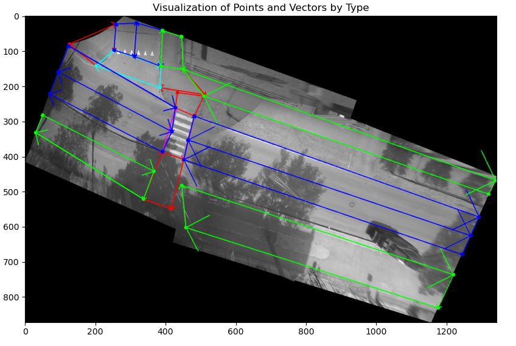
*Figure 4. Vector Representation of Environmental Infrastructure on Torpagatan*

For the environmental infrastructure, points were manually selected to represent static objects from the scene and
Cartesian coordinates such as posts, trees, and signs. The original positional coordinate values must be scaled to set
the image size. While adding coordinates for static objects can be relatively simple, representing other infrastructure
variables such as sidewalks, lanes, and crosswalks for a learnable feature can be more challenging. Inspired by Gao
et al. (2020) use of vectorized representations of agent trajectories and the scene maps. This contrasts their vector
feature representation in the global graph using polylines and polygraphs. The approach used is to use Cartesian
coordinates of four points representing the area of the infrastructure variable. As shown in Fig. 4, coordinates are
used to calculate vectors from one corner to the other. For the spatial representation between the traffic participants
and these environmental infrastructure features the euclidean distance of the nearest point on the the nearest vectorof the particular area is used. In addition, a limited coordinate augmentation is conducted to improve the robustness
and generalization of the models. The basic idea is to apply various transformations to the coordinates of the data
points, creating new, augmented versions of the original data. This helps the model better generalize over different
variations of the input data. Sometimes, a random offset shift coordinates, Gaussian noise is added or is rotated. This
is not done for all the data but instances that had only one agent present and that the previous instance and the next
are of the same ID. This was done as to not inadvertently affect the spatial relations and interactions between agents
and objects. Additionally, the X, Y, and Speed variables were normalized using a min-max scaler EQ. 5 where a
feature x is scaled using the minimum and maximum.

*Equation 5*

$$x' = \frac{x - x_{\text{min}}}{x_{\text{max}} - x_{\text{min}}}$$

### Implementation
This section delves into the detailed implementation of the model, covering aspects such as process, feature embed-
dings, model architectures, metrics, and parameters. It begins by discussing graph representation, emphasizing the
advantages of using graphs to model relationships between agents in dynamic environments. This is followed by
discussing feature embeddings, which cover the representation of input features such as type, Cartesian coordinates,
and speed. The section offers a comprehensive overview of the spatial-temporal graph transformer model for TP,
covering theoretical concepts, implementation details, and evaluation metrics.

#### Process
Graphs are an advantageous data structure that can be represented in either a Euclidean graph or a non-euclidean one where the graph $\mathcal{G}$ = $\mathcal{\{V, E}\}$ the nodes represented as $\mathcal{V}$ = \{$v_1, v_2, v_3, ..., v_N$\} and their relations or edges $\mathcal{E}$ = \{$e_1, e_2, e_3, ..., e_N$\}. In the temporal Transformer of the first model, only the nodes are used with the features of Type, Cartesian coordinates of X and Y, and the speed in km/h. The spatial transformers in the second and third models utilize an Euclidean distance-based edge representation.  In EQ. 6, the Euclidean distance is calculated for two Cartesian system points where $\{X_1, Y_1\}$ are one point and $\{X_2, Y_2\}$ are another. The difference between $(X)$ of both points is squared and added to the points of the difference of $(Y)$ squared points, and the root value is the Euclidean distance. 

*Equation 6*
$$\text{Euclidean distance} = \sqrt{{(x_2 - x_1)}^2 + {(y_2 - y_1)}^2}$$

 The Euclidean distance for the agents and static objects like trees, signs, and poles works as they represent their precise coordinates. The agents' distances are calculated to infrastructure with area, the vectors that make up that area are used, taking the nearest perpendicular distance. The formula for calculating the absolute perpendicular distance to a line is found in EQ. 7. The $(X, Y)$ are the Cartesian coordinates of the agent, while the $(X_1, Y_1)$, and $(X_2, Y_2)$ are the points representing the line. The numerator calculates the relative position of the point concerning the line, whether the positive signed area where the point lies to the left of the line, negative where it lies to the right of the line, or zero where it is on the line. The absolute value ensures that the numerator is positive, and the denominator calculates the line length using Euclidean distance.

*Equation 7*

$$d = \frac{{| (y_2 - y_1) \cdot x - (x_2 - x_1) \cdot y + x_2 \cdot y_1 - y_2 \cdot x_1 |}}{{\sqrt{{(y_2 - y_1)^2 + (x_2 - x_1)^2}}}}$$

Each node is an agent for each time step in the input and output sequences, although the output sequence contains only
the Cartesian coordinates. The sequence length for each of the inputs is 10, while the output has a sequence length
of 40. The spatial features for each instance needs to be of a consistent size so the maximum number of possible
agents plus the number of environmental infrastructure objects. The model initially needs to learn these values and
will handle them as relevant features. Additionally, a subsequent mask is used to avoid attending to positions that
should be attended in the future. This is handled using masking found in Fig. 5, a simple attention mask where the
dimensions are sequence length four by sequence length four; it is a boolean triangle mask where ones represent
features that should not be attended to where zero represents the features that need attention. The tensor is expanded
to include the batch size x num heads in the Transformer. The subsequent mask ensures that the model pays attention
to the correct features at the correct time step.

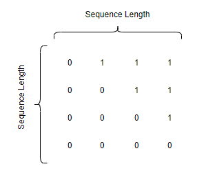

*Figure 5. Subsequent Mask*

#### Embeddings
The temporal embeddings found in Fig. 6a used in the all models except in the Transformer Models the baseline uses
just the Cartesian coordinates by using a linear layer for the X and Y for both input and output. The Semantic Aware
Transformer (SA-Transformer) uses the embedding as is on the the input but in the output only Cartesian coordinates
are used. The input uses linear layers as the embedding for the X, Y, and Speed features, while the Type feature
uses an embedding layer. These features are embedded separately and then concatenated together in the size of the
embedded dimension. This approach was chosen to facilitate the model’s learning of the embeddings of the individual
features rather than combining them into a single embedding and potentially losing the features’ representation. The
size of the vocab for the Type feature is the number of different classes. The temporal Transformer has four classes, as the infrastructure classes are excluded. The number of classes varies based on the location, with the Torpagatan
location having ten unique classes and the Valhallavägen location having nine unique classes. These classes include
Crosswalk, Zebra Crossing Crosswalk, Lane, Pre-Crosswalk, Sidewalk, Street Sign, Post, and Tree.

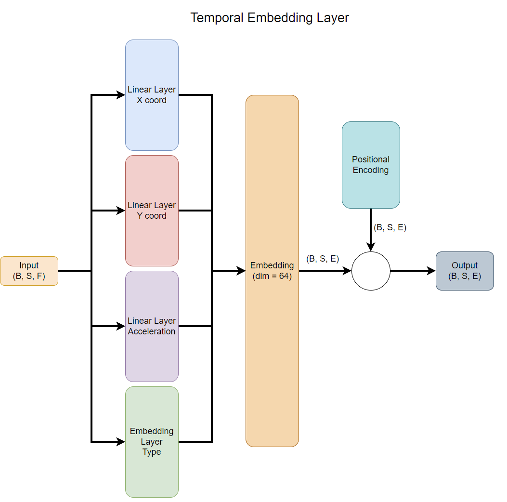
*(a) The Temporal Embedding Layer with Positional Encoding*

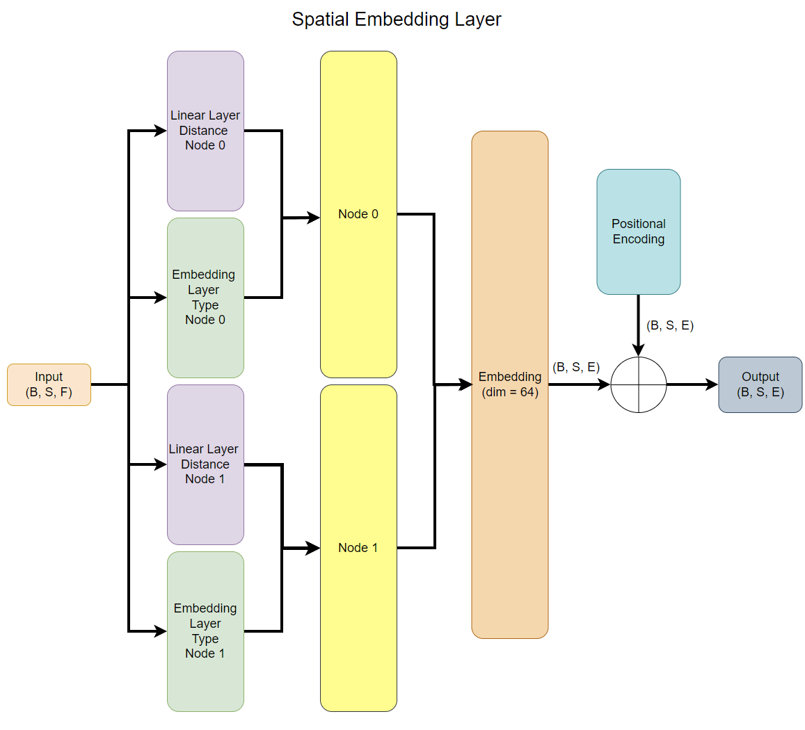
*(b) The Spatial Embedding Layer with Positional Encoding*

*Figure 6. Temporal and Spatial Embedding Layers*

Fig. 6a demonstrates the input into the embedding layer where the B is the batch size, S is the sequence length, and F
is the features. The X, Y, and acceleration features are passed through a linear layer, while the type is passed through
an embedding layer. The features are then concatenated together into a single embedding dimension of sixty-four.
The positional embedding is then applied to each of the embeddings. The spatial embeddings found in Fig. 6b, the
input are the Euclidean distances of the other agents in the scene and their class type. Similarly, B is the batch size,
S is the sequence length, and N is the number of agents. The distance and type are first embedded separately, then
concatenated into a single embedding feature and concatenated to the overall embedding dimension. So, the overall
spatial embedding is an embedding of each agent’s distances, and their type and positional encoding are applied.

#### Transformer Implementation
The base Transformer implementation found in Fig. 7 follows a similar implementation of the traditional transformer
model. The inputs are the features of Type, X, Y, and Speed for the semantic model, with a sequence length of 10
for the input and 40 for the target outputs. The non-semantic model uses just the X and Y Cartesian coordinates
with the same number of sequences for both input and target outputs, with the rest of the model following a similar
implementation. The inputs and target outputs are processed through the embedding layer, which is embedded
into a dimension of 128. The input has dropout regularization applied with a probability of 0.3 and ReLU activation
function before the values are permuted with the batch dimension and sequence switching positions. The input is then
processed through the encoder of the transformer, which has 16 layers and 8 heads. The memory from the encoder and
the target outputs are processed through the decoder, with the output being permuted to the original batch dimension
in the first position of the tensor and the sequence in the second. The permuted decoder output is then processed by
an MLP decoder with 256 hidden neurons, and the architecture consists of two fully connected linear layers, each
followed by a ReLU activation function. The network is designed to take an input tensor and pass it through these
layers, transforming it into an output tensor. To prevent overfitting during training, dropout regularization is applied
after both the input and the first linear layer, with a dropout probability of 0.3. This technique helps improve the
model’s generalization capability by randomly dropping out units during training, effectively reducing the network’s
reliance on specific input features. The ReLU activation functions introduce non-linearity to the model, enabling it to
learn complex relationships within the data. The output of the MLP decoder is a prediction of the next 40 time steps
for the particular agent.

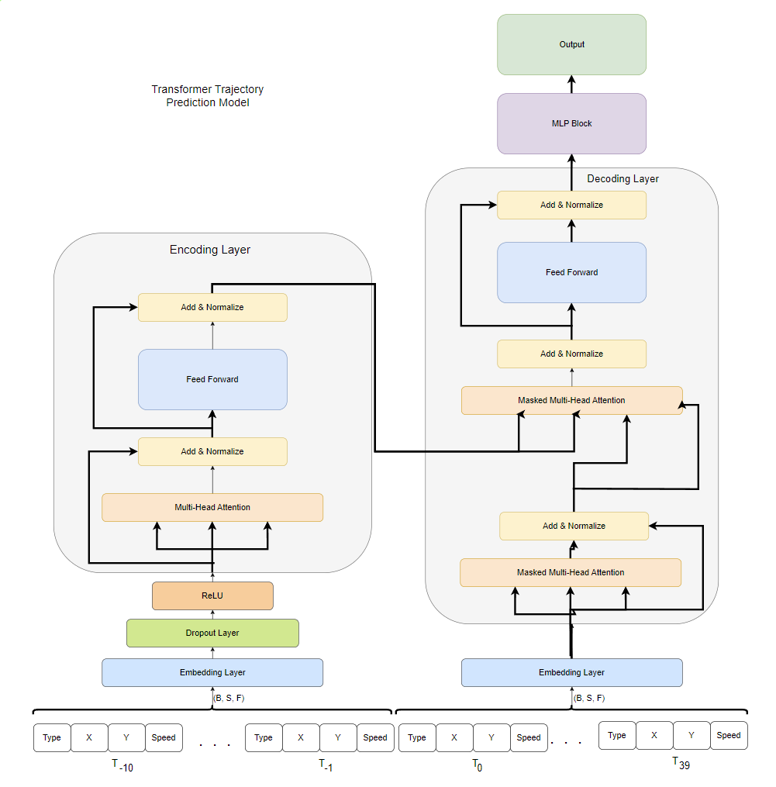
*Figure 7. Transformer Implementation*

#### Spatial-Temporal Graph Transformer Implementation
The Spatial-Transformer model is modeled after Yu et al. (2020) although with variations, as they predicted the steps
sequentially, processing the predictions back into the model to predict the next sequence. They also incorporated
graph memory, where the second temporal encoder returns the output to the initial temporal encoder. In this model
implementation found in Fig. 8, the temporal inputs consist of the features of Type, X, Y, and Speed for the semantic
model, with a sequence length of 10 for the input and 40 for the target outputs. The spatial inputs consist of an array
with the length of the maximum number of agents for the particular location for the model without the environmental
infrastructure. The model with the environmental infrastructure variables has an array size of the maximum number
of agents and objects. An additional array holds the types for the representation of the distances. The spatial and
temporal inputs are processed in their respective embedding layers, where the embedding dimension size is 128. Each
of the embeddings has dropout regularization applied with a probability of 0.3 and ReLU activation function before
the values are permuted with the batch dimension and sequence switching positions. Both the spatial and temporal
Transformer encoders have 16 layers with 8 heads. The encoders’ outputs are then concatenated and processed
through a fully connected linear layer. The output of the fully connected layer is then processed through the second
spatial encoder and the second temporal transformer both of which have the same number of layers and heads as
the previous encoders. The output is permuted to the original batch dimension in the first position of the tensor and
the sequence in the second. The permuted final temporal encoder output is then processed by four MLP decoders,
with each of the decoders handling four sequences of time steps of 10; the architecture for each of the MLP decoders
consists of two fully connected linear layers with 256 hidden neurons, each followed by a ReLU activation function.
To prevent overfitting during training, dropout regularization is applied after both the input and the first linear layer,
with a dropout probability of 0.3. The final output is a concatenation of each of the outputs from the decoders.

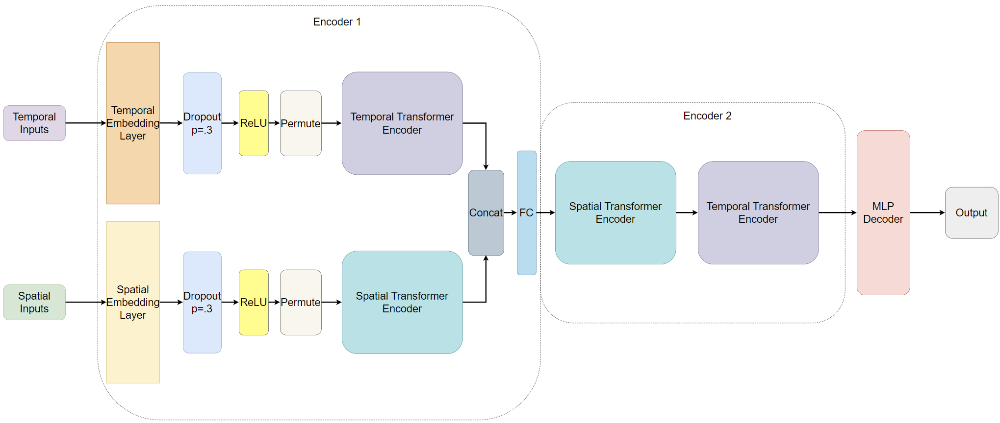
*Figure 8. Spatial Temporal Graph Transformer*

Graph memory was unnecessary with the changes in how the prediction is handled and the proper handling of
positional encoding and subsequence masking. Theoretically, the Transformer encoders should be able to handle
the attention of the sequences properly. In addition, the models should be able to learn the representations needed
for their tasks, with the initial spatial encoder handling the spatial features and the temporal encoder handling the
temporal features separately. They should learn the embedding representations and translate them to relevant vectors
for the combined task in the second encoder layer. With back-propagation on the decoders, they should learn the
network should each learn on their time sequences.

### Trajectory Prediction Metrics
Several metrics are commonly used to quantify there accuracy and reliability in evaluating the performance of TP
models. Among these metrics are the Average Displacement Error (ADE) and the Final Displacement Error (FDE),
which provide insights into the model’s ability to predict the future positions of moving entities accurately.

The ADE formula in EQ. 8 measures the average Euclidean distance between the predicted and ground truth trajecto-
ries over a specified prediction horizon. It is calculated as the mean of the Euclidean distances between corresponding
predicted and ground truth positions at each time step.

*Equation 8*
$$ADE = \frac{1}{N} \sum_{i=1}^{N} \left\| \mathbf{p}_i - \mathbf{g}_i \right\|$$

The FDE EQ. 9 measures the Euclidean distance between the final predicted position and the actual final position of
the trajectory. It provides a snapshot of the model’s accuracy at the end of the prediction horizon.

*Equation 9*
$$FDE = \left\| \mathbf{p}_N - \mathbf{g}_N \right\|$$

The minimum ADE in EQ. 10 presents the minimum value of the ADE, making it possible to see how well the best
predictions are doing concerning the average overall ADE.

*Equation 10*
$$minADE = \min_{j} \left( \frac{1}{N_j} \sum_{i=1}^{N_j} \| \mathbf{p}_{ij} - \mathbf{g}_{ij} \| \right)$$

Similarly, the minimum FDE in EQ. 11 presents the minimum value of the FDE, making it possible to see how well
the best predictions are doing concerning the average overall FDE.

*Equation 11*
$$minFDE = \min_{j} \| \mathbf{p}_{Nj} - \mathbf{g}_{Nj} \|$$

#### Loss Function
Mean Squared Error (MSE) Loss is a commonly used loss function in TP tasks due to its effectiveness in measuring
the discrepancy between predicted and ground truth trajectories. It quantifies the average squared difference between
the predicted and actual values, emphasizing larger deviations and penalizing them accordingly. In the EQ. 12 N is
the number of samples, yi represents the ground truth trajectory, and ˆyi is the predicted trajectory. One of the key
advantages of using MSE Loss for TP is its ability to provide a continuous and smooth measure of prediction error.
Additionally, MSE Loss encourages the model to focus on accurately predicting both the direction and magnitude
of future movements, which is crucial in TP tasks where small errors can lead to significant deviations over time.
Overall, MSE Loss is a reliable and intuitive metric for evaluating the performance of TP models and guiding their
training process toward more accurate predictions.

*Equation 12*
$$\text{MSE Loss} = \frac{1}{N} \sum_{i=1}^{N} (y_i - \hat{y}_i)^2$$

### Experimental Parameters
In all of the TP model implementations, careful consideration was given to configuring the experimental parameters
to ensure optimal performance and robustness. These parameters, which govern various aspects of the model archi-
tecture and training process, were selected to balance complexity and efficiency. The Transformer model architecture
was defined with 16 layers in both the encoder and decoder components, providing sufficient depth to capture intricate
spatial-temporal dependencies in trajectory data. This choice allows the model to learn hierarchical representations
of trajectory sequences, effectively extracting relevant features and interactions. Moreover, 8 attention heads were
utilized in the self-attention mechanism, simultaneously facilitating multi-headed attention to different parts of the
input sequence. This enhances the model’s ability to capture long-range dependencies and inter-agent interactions,
which is crucial for accurate trajectory prediction. The model was trained for 300 epochs, allowing it to learn from
the training data and refine its parameters iteratively. The Adam optimizer guided the training process with a learning
rate of 0.000015, chosen to balance the trade-off between convergence speed and stability. Adam’s adaptive learning
rate mechanism enables efficient optimization by adjusting the learning rates for individual parameters based on their
gradients, enhancing training efficiency.

## Results
The results chapter comprehensively evaluates TP models, employing quantitative metrics and qualitative visual-
izations to assess performance. Key metrics such as ADE, FDE, minADE, and minFDE compare the proposed
SAE-STAR model against baseline models across different datasets and agent classes. Class-wise comparisons re-
veal the model’s robustness across diverse scenarios involving vehicles, pedestrians, and cyclists. Qualitative analysis
through prediction error heatmaps and visualizations of agent interactions further enhances understanding, highlight-
ing spatial error distributions and dynamic agent behaviors. These findings provide valuable insights for improving
TP models and advancing SOTA capabilities in predicting complex agent trajectories.

###  Quantitative Results
In TP, quantitative metrics are essential for evaluating model performance and facilitating comparative analyses. This
section presents a comprehensive quantitative evaluation of our TP model using key performance metrics: ADE, FDE,
minADE, and minFDE. ADE measures the average distance between predicted and true trajectories over all time
steps, while FDE focuses on the final time step, providing insights into long-term prediction accuracy. The minADE
and minFDE metrics highlight the model’s precision, evaluating the best prediction among multiple hypotheses. The
proposed SAE-STAR is compared against a baseline Transformer, a Semantic Aware Transformer (SA-Transformer),
and a Semantic Aware Spatial-Temporal grAph tRansformer (SA-STAR) models using these metrics, benchmarking
its performance and identifying strengths and areas for improvement. Additionally, a class-wise comparison across
different agent types, such as vehicles, pedestrians, and cyclists, reveals the model’s robustness and versatility in
diverse prediction scenarios. This quantitative analysis thoroughly assesses our model’s accuracy, reliability, and
comparative performance.

#### Model Comparison
This section comprehensively compares different TP models using two distinct datasets. The evaluation focuses
on four key metrics: ADE, FDE, minADE, and minFDE. ADE measures the average Euclidean distance between
predicted and actual trajectories over the entire prediction horizon, providing an overall accuracy assessment. FDE
evaluates the Euclidean distance at the final predicted point, offering insights into the models’ endpoint accuracy.
MinADE and minFDE represent the best-case scenarios for ADE and FDE, respectively, highlighting the models’
optimal performance under ideal conditions. While this comparison does not specifically address the multi-class
aspect of the models, it focuses on their overall performance across different scenarios and environments. By com-
paring these metrics across multiple models and datasets, the aim is to identify the strengths and weaknesses of each
approach, thereby advancing the SOTA in TP.

*Table 4 Performance Metric Results by Model and Location in meters*
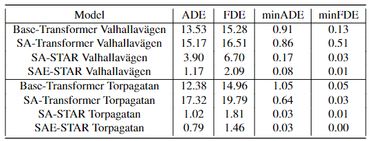

The results found in Table 4 illustrate the performance metrics for various trajectory prediction models across Val-
hallavägen and Torpagatan datasets; the original data was produced in pixels, although 20 pixels is equivalent to 1
meter. In Valhallavägen, the Base-Transformer model shows fairly poor accuracy with an ADE of 13.53 and FDE of 15.28, while the SA-Transformer has slightly higher errors. The SA-STAR model significantly improves pre-
diction accuracy with lower ADE (3.90) and FDE (6.70). The SAE-STAR model performs the best, achieving an
ADE of 1.17 and FDE of 2.09. The SA-STAR Valhallavägen model produced the worst among the STAR models,
with an ADE of roughly 3 meters. In Torpagatan, the Base-Transformer again demonstrates moderate performance
(ADE of 12.38, FDE of 14.96), and the SA-Transformer performs worse. The SA-STAR model shows significant
improvement (ADE of 1.02, FDE of 1.81), with the SAE-STAR model achieving the highest accuracy (ADE of 0.79,
FDE of 1.46). These results indicate that the SAE-STAR model consistently outperforms others in both locations,
demonstrating superior prediction accuracy and precision.

#### Class Comparison
This section comprehensively compares different TP models using two distinct datasets. While overall performance
metrics such as ADE, FDE, minADE, and minFDE provide a broad evaluation of the models’ accuracy, this section
highlights explicitly how well the models perform across different classes of agents. The multi-class comparison
is crucial as it provides a more comprehensive understanding of the models’ performance, especially in real-world
scenarios involving different moving entities. Examining these metrics within the context of different classes aims
to uncover insights into the models’ ability to handle diverse prediction tasks. This is particularly important for
applications involving varied types of moving entities, such as pedestrians, vehicles, and cyclists. TP models can be
enhanced in complex, real-world environments by analyzing the models’ performance across multiple classes and
identifying the approaches that offer robust and reliable predictions for different agent types.

*Table 5
Performance Metric Results by Model and Pedestrian Class in meters*

The results found in Table 5 across Valhallavägen and Torpagatan for the pedestrian class. In Valhallavägen, the
Base-Transformer model shows poor accuracy with an ADE of 13.39 and FDE of 13.83, while the SA-Transformer
has slightly higher errors (ADE of 15.08 and FDE of 15.44). The SA-STAR model significantly improves prediction
accuracy with lower ADE (2.86) and FDE (4.54), and the SAE-STAR model performs the best, achieving an ADE of
0.90 and FDE of 1.50. In Torpagatan, the Base-Transformer again demonstrates poor performance (ADE of 13.51,
FDE of 13.79), and the SA-Transformer performs worse (ADE of 17.32, FDE of 19.79). The SA-STAR model shows
significant improvement (ADE of 1.11, FDE of 1.82), with the SAE-STAR model achieving the highest accuracy
(ADE of 0.85, FDE of 1.44). These results indicate that the SAE-STAR model consistently outperforms others in
both locations, demonstrating superior prediction accuracy and precision. In addition, the SAE-STAR model for
Valhallavägen also saw an improvement over the overall model in both metrics. The SA-STAR Torpagatan models
saw a small drop in performance; similarly, the SAE-STAR model saw a small decrease in ADE but a slight increase
in performance in FDE.

*Table 6
Performance Metric Results by Model and Bicyclist Class in meters*

The results found in Table 6 demonstrate a notable decline in performance for the SA-STAR Valhallavägen model
compared to the overall model results shown in Table 4. This drop in performance is significant as it indicates
the model’s limitations in accurately predicting the movements across both Valhallavägen and Torpagatan for the
bicyclist class. In Valhallavägen, the Base-Transformer model shows poor accuracy with an ADE of 14.52 and FDE
of 15.40, while the SA-Transformer has slightly higher errors (ADE of 16.90 and FDE of 17.18). The SA-STAR
model significantly improves prediction accuracy with lower ADE (4.52) and FDE (8.63), and the SAE-STAR model
performs the best, achieving an ADE of 1.54 and FDE of 3.01. In Torpagatan, the Base-Transformer performs poorly
(ADE of 11.76, FDE of 14.64), and the SA-Transformer performs worse (ADE of 17.32, FDE of 19.79). The SA-
STAR model shows significant improvement (ADE of 1.59, FDE of 2.96), with the SAE-STAR model achieving the highest accuracy (ADE of 1.30, FDE of 2.49). These performance drops indicate that both SA-STAR and SAE-
STAR models face challenges in maintaining accuracy across different locations, particularly in predicting bicycle
trajectories.

*Table 7
Performance Metric Results by Model and Light Vehicle Class in meters*

The results found in Table 7, the SA-STAR Valhallavägen model saw a significant drop in performance over the
overall model found in Table 4. In Valhallavägen, the Base-Transformer model shows a poor performance with an
ADE of 13.79 and FDE of 20.20, while the SA-Transformer has slightly higher errors (ADE of 15.06 and FDE of
20.04). The SA-STAR model significantly improves prediction accuracy with lower ADE (7.26) and FDE (13.38),
and the SAE-STAR model performs the best, achieving an ADE of 1.89 and FDE of 3.87. In Torpagatan, the Base-
Transformer performs poorly (ADE of 11.61, FDE of 15.86), and the SA-Transformer performs worse (ADE of
17.32, FDE of 19.79). The SA-STAR model shows significant improvement (ADE of 0.85, FDE of 1.61), with
the SAE-STAR model achieving the highest accuracy (ADE of 0.65, FDE of 1.30). The SAE-STAR model for
Valhallavägen also saw a drop in performance over the overall model, with an increase of ADE of 0.5 meters and an
increase of FDE of 1.5 meters. Conversely, the STAR models demonstrated the best performance for the light vehicle
class, showing an improvement of approximately 0.25 meters in both ADE and FDE across the models.

*Table 8
Performance Metric Results by Model and heavy Vehicle class in meters*

The results found in Table 8, the SA-STAR Valhallavägen, as with the other classes, had a significant drop in per-
formance over the overall model found in Table 4. The SAE-STAR model for Valhallavägen also saw a drop in
performance over the overall model, with an increase of 1 meter for ADE and FDE. The STAR models for Torpa-
gatan saw an increase of 0.5 meters for the ADE, with the FDE increasing roughly 1 meter, although the SA-STAR
model outperformed the FDE. In Valhallavägen, the Base-Transformer model performs poorly with an ADE of 13.25
and FDE of 20.32, while the SA-Transformer shows slightly higher errors (ADE of 14.24 and FDE of 19.59). The
SA-STAR model significantly improves prediction accuracy with lower ADE (7.42) and FDE (13.96), and the SAE-
STAR model performs the best, achieving an ADE of 2.29 and FDE of 3.57. In Torpagatan, the Base-Transformer
performs poorly (ADE of 12.81, FDE of 15.97), and the SA-Transformer performs worse (ADE of 17.32, FDE of
19.79). The SA-STAR model shows significant improvement (ADE of 1.46, FDE of 2.61), with the SAE-STAR
model achieving the highest accuracy (ADE of 1.31, FDE of 2.77).

### Qualitative Results
In TP, accurately forecasting the future positions of agents within a dynamic environment is crucial for applications
like autonomous driving and robotics. While quantitative metrics like MSE, ADE, and FDE provide numerical in-
sights, qualitative analysis through visualization offers a deeper understanding of model performance. This section
explores qualitative results using prediction error heatmaps, which reveal spatial distributions of errors and iden-
tify challenging regions; visualizations of agent interactions, highlighting how the model anticipates and adapts to
behaviors such as pedestrian crossings; and visualizations of agent and object interactions, assessing the model’s
integration of environmental contexts, such as road signs and obstacles. These visual tools complement quantitative
metrics by uncovering the dynamics and contextual factors influencing predictions, guiding model improvements,
and enhancing the efficacy of TP systems.
#### Prediction Error Heatmaps
In TP, understanding where and why prediction errors occur is crucial for refining model performance. Heatmaps
of prediction errors serve as a powerful visualization tool to highlight the spatial distribution of these errors across
different environments. By examining these heatmaps, specific areas where the model struggles can be identified,
such as complex intersections, areas with dense traffic, or regions with unpredictable agent behavior. This detailed
spatial analysis helps pinpoint contextual challenges and offers insights into the underlying causes of errors that
aggregate metrics might obscure. The following section delves into these heatmaps, providing a visual and intuitive
understanding of the model’s performance across various scenarios and environments.

*(a) Valhallvagen* 
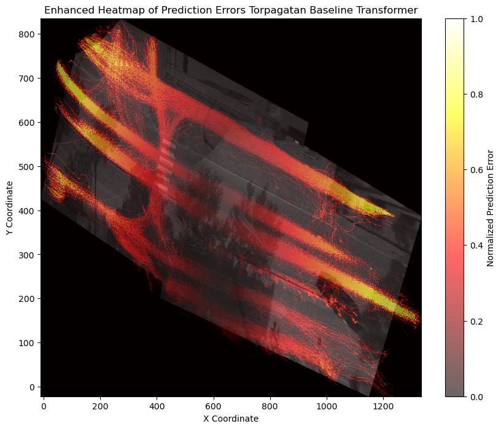
*(b) Torpagatan*

*Figure 9. Valhallvagen and Torpagatan Heatmap of Prediction Errors on Transformer Baseline*

The Baseline-Transformer model prediction error is similar to the SA-Transformer model, found in Fig. 9a, a nor-
malized representation of the Valhallavägen dataset results. Most prediction errors can be seen on the lower portion
and around the pedestrian crossing. The Torpagatan Baseline-Transformer prediction error found in Fig. 9b has a
more uniform prediction error across the entire region, with the highest degree of prediction error results occurring
towards the end of the sequence predictions.

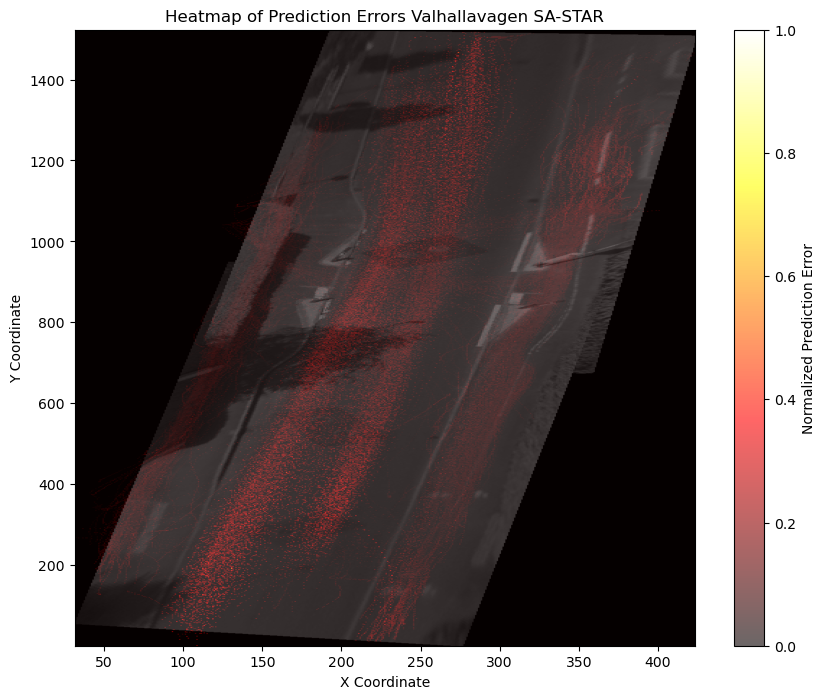
*(a) Prediction Error Heatmap* 
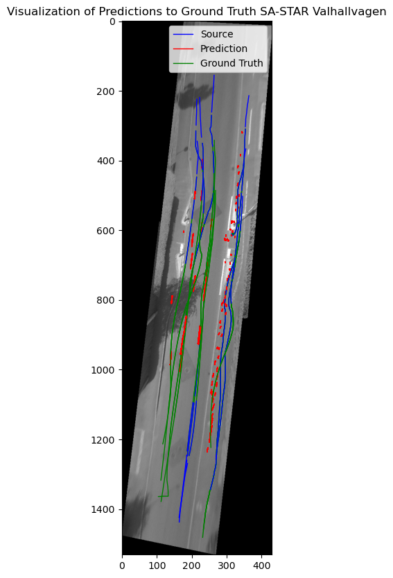
*(b) Prediction to Ground Truth Trajectories*

*Figure 10. Valhallvagen SA-STAR Prediction Error Heatmap and Prediction to Ground Truth Comparison*

The Valhallavägen heatmap of prediction errors for the SA-STAR model can be found in Fig.10a, the errors showing
that vehicles have the highest prediction error. Further investigation into this through the visualization of the predicted
trajectories to ground truth on 100 instances can be found in Fig. 10b. The SA-STAR Valhallavägen model predicts
very short steps for each trajectory. The prediction error of the vehicles is related to the distance they can travel
within the prediction time step. The prediction error for other classes, such as pedestrians and bicyclists, is largely
due to the distance a pedestrian can travel within the prediction window.

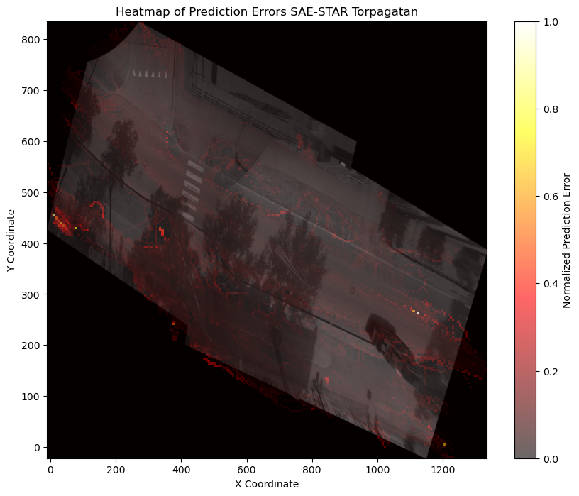
*(a) Torpagatan*
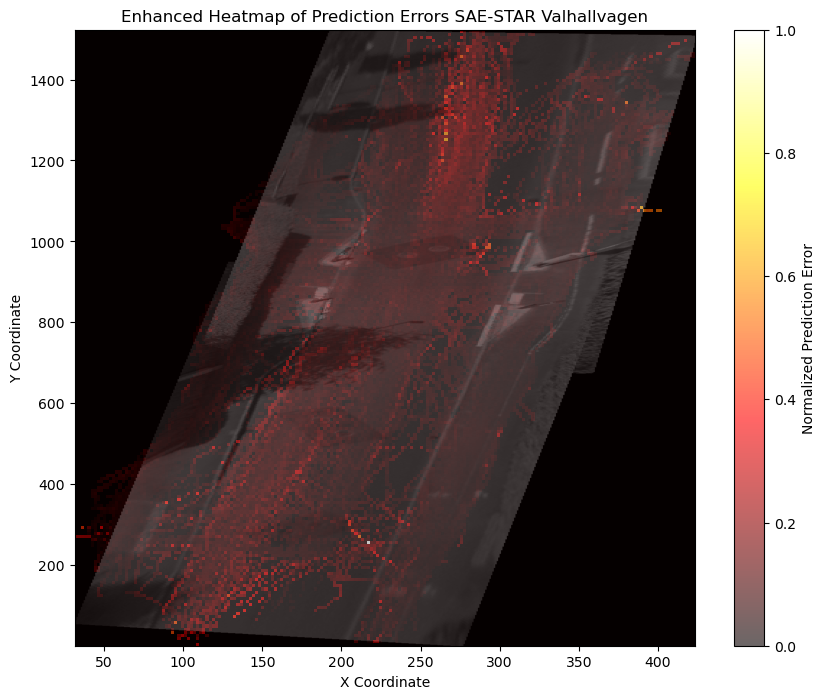
*(b) Valhallavägen*

*Figure 11. Torpagatan and Valhallavägen SAE-STAR Prediction Error Heatmap*

The prediction errors heatmap of the SAE-STAR models on both datasets using the same scale as the previous models
was difficult to visualize due to the low error. As such, to better visualize the data, the scale for Torpagatan and
Valhallavägen was set to 200, and the normalized visualizations were presented. Found in Fig. 11a, the Torpagatan
Prediction Error remains low, although a small region can be seen as having more errors. Based on the location it is
difficult to determine the main influence in the prediction error.

#### Interactions Between Agents and Environmental Infrastructure
Evaluation of the interactions between static objects is challenging to represent; metrics could only be identified for
the evaluation if visualization is used. Fig. 12 shows four regions of interest for the Torpagatan location; the objects
are two signs on the left and two trees on the right-hand side; the other objects within the scene had little to no
interactions, so they were excluded. What is seen in these images are all the interactions for the test set with these
objects, the green being the ground truth while the red is the prediction.

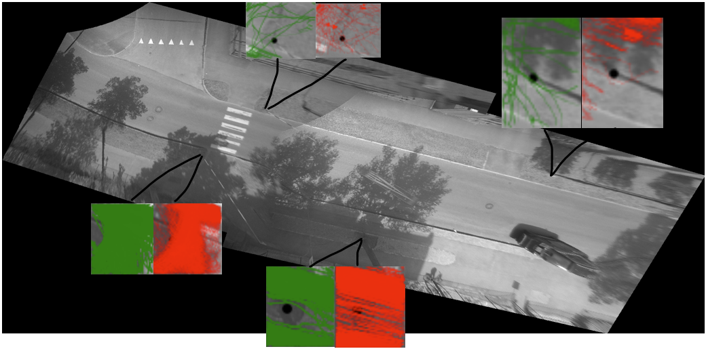
*Figure 12. Torpagatan Regions of Interest*

A close-up of the street sign located at the bottom left of Fig. 12 can be seen in Fig. 13a, which demonstrates that the ground truth showed little interaction with the street sign with the trajectories overlapping the sign location,
as such the prediction holds a similar result. Similar results can be seen for the object interactions between the
Valhallavägen models, where the ground truth intersects with the object locations and the predictions. The large tree
found in Fig. 13b shows that the interaction is well formed with a clear delineation between the static object and the
trajectories for the ground truth. The interaction between the predicted trajectories shows the intersection with the
tree.

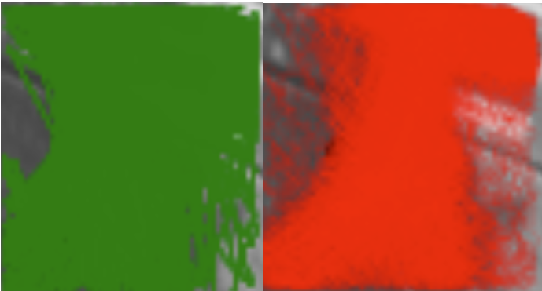
*(a) Street Sign Torpagatan Bottom Left*
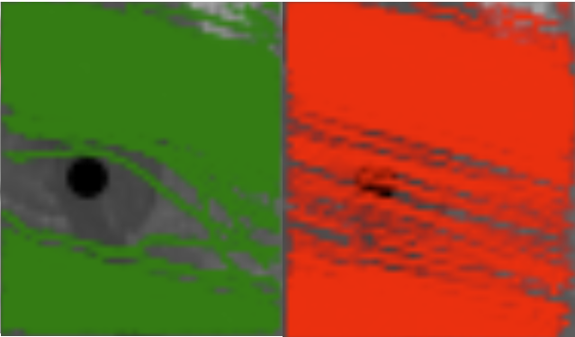
*(b) Large Tree Torpagatan Bottom Right*

*Figure 13. Region of Interests Close-up*

#### Interactions between Agents
This section delves into the qualitative visualization of agent interactions as predicted by the best-performing SAE-
STAR Torpagatan model. Visualizations play a crucial role in understanding agent trajectories’ dynamic and complex
nature, offering an intuitive grasp of how agents interact with each other and their environment. By presenting a series
of visual analyses, illustrating the strengths and weaknesses of the model in capturing these interactions. These
visualizations provide a detailed look at the scenarios where the model performs well and highlight areas needing
improvement. Through this qualitative lens, deeper insights can be gained into the model’s behavior, complementing
the quantitative metrics discussed earlier.

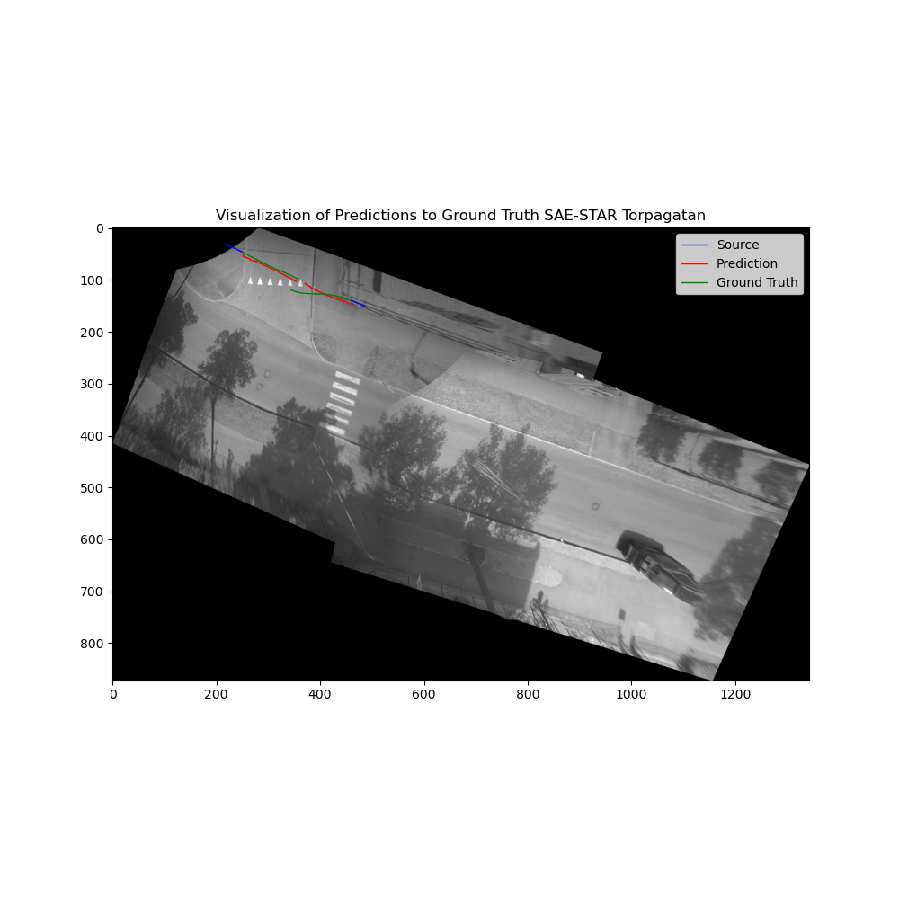
*(a) 1st Predicted Trajectory*

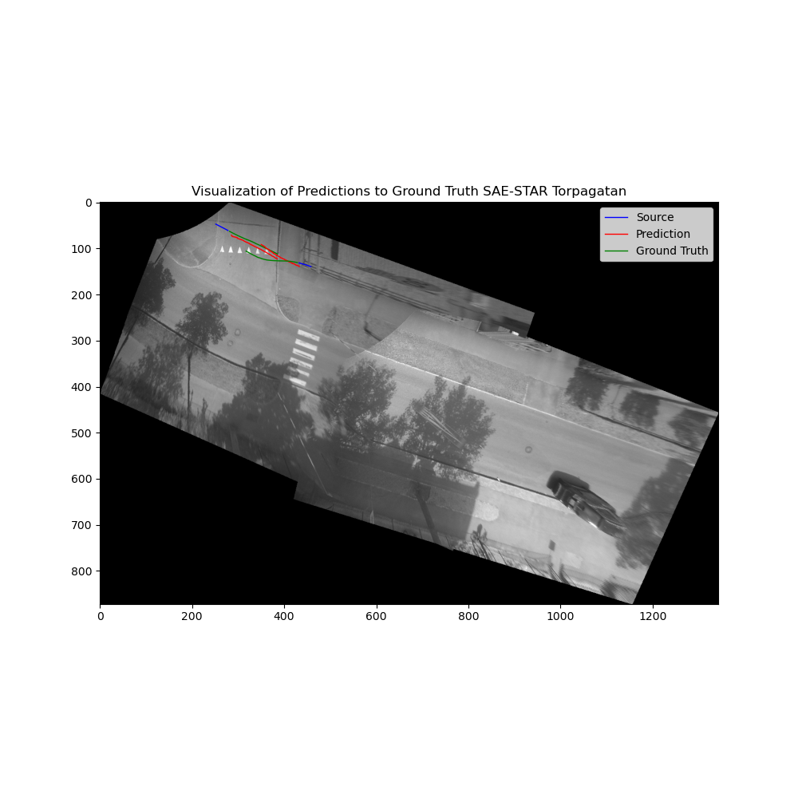
*(b) 2nd Predicted Trajectory*

*Figure 14. Torpagatan Pedestrian Interactions*

The interactions between pedestrians can provide insight into their agent interactions found in Fig. 14 is an interaction
between pedestrians along a similar trajectory. The initial prediction that both agents are headed for a collision with
one another is found in Fig. 14a, while the right-most pedestrian actual trajectory veers to the left to avoid. In the
next prediction in Fig. 14b, the right-most pedestrian’s trajectory continues to veer left. The prediction actually
veers slightly to the right. Many other instances found within the results show similar performance, where the model
prediction shows a slight change in trajectory to avoid collisions. Although some instances collide in their predictions,
more instances can be found in Appendix B.

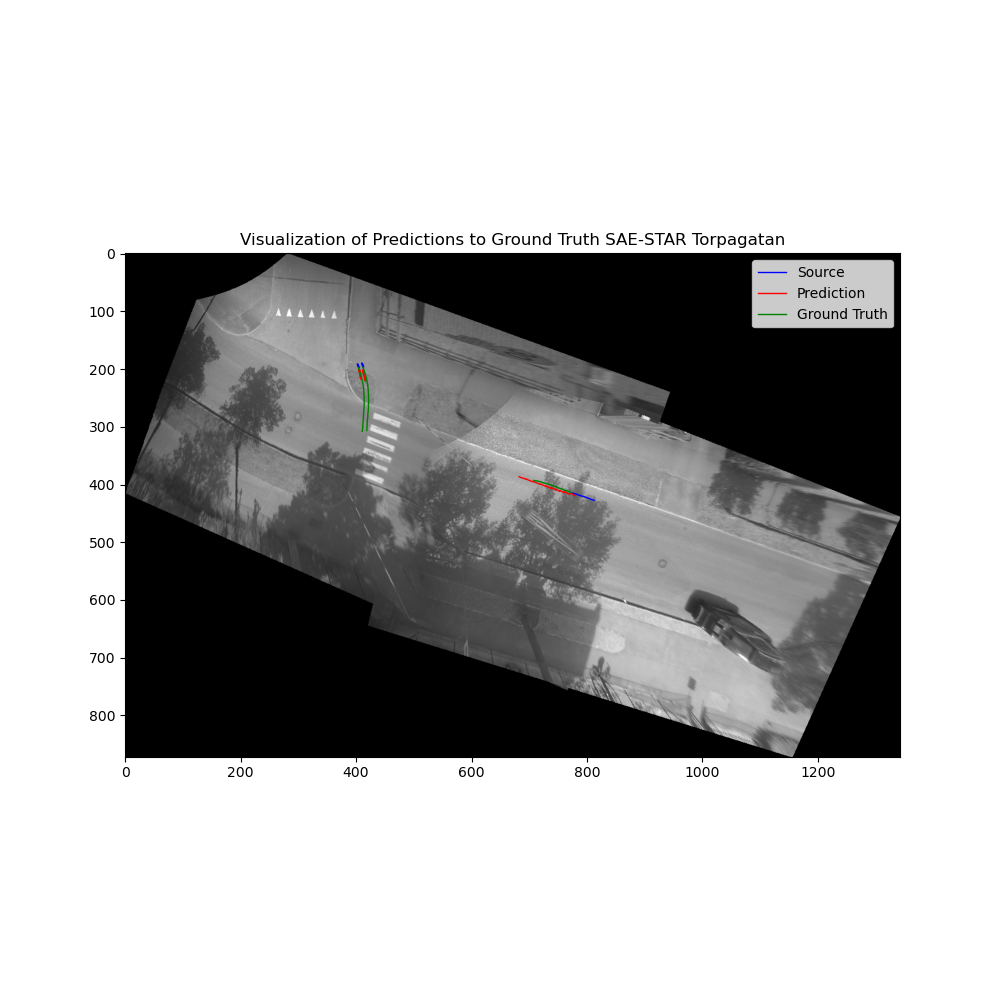
*(a) 1st instance 2 Pedestrians and Vehicle* 
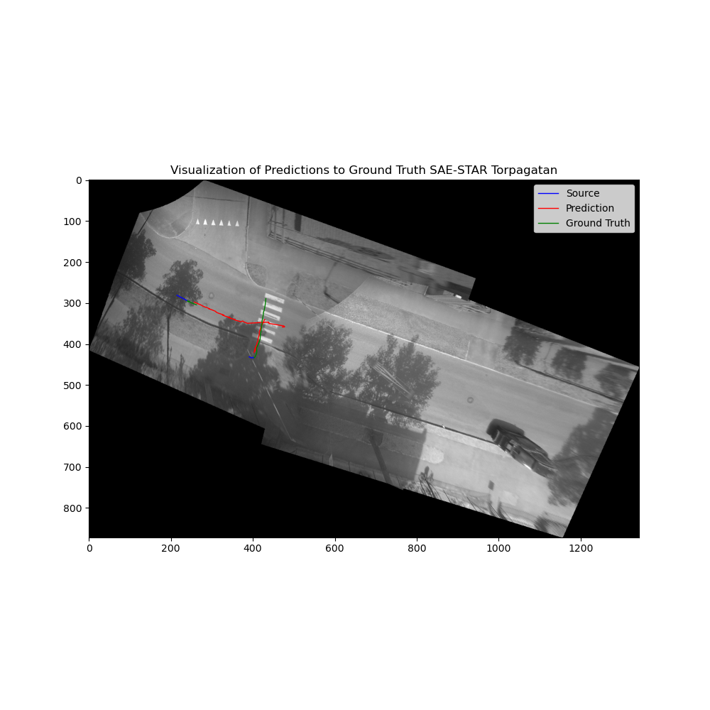
*(b) 2nd instance Pedestrian and Vehicle*

*Figure 15. Two interactions between Vehicles and Pedestrians Torpagatan*

An important interaction between agents is that of light vehicles and pedestrians found in Fig. 15 are 2 interactions
that highlight the interactions. In the first interaction found in Fig. 15a are 2 pedestrians preparing to cross the
street using the sidewalk. The model predicts that the pedestrians will stop and wait for the vehicle to go, but it is
decelerating. The actual trajectory shows that the pedestrians continued, found in AppendixC is the full sequence.
In the next prediction, the vehicle slows down even further, and both the prediction and actual trajectories show
that pedestrians are crossing. In the 2nd interaction found in Fig. 15b, a pedestrian has approached the crosswalk.
The model predicts the pedestrian will go slowly while the actual trajectory reveals that they walked at a normal or
accelerated pace. The vehicle predicts that the vehicle will go through maneuvering to avoid the pedestrian, while

## 5 Discussion
The Discussion chapter presents a comprehensive evaluation of TP models, focusing on the performance assessment
of the SAE-STAR model against baseline models across diverse datasets and agent classes. Quantitative metrics
such as ADE and FDE provide numerical insights, complemented by qualitative visualizations like prediction error
heatmaps and agent interaction dynamics. These analyses offer a nuanced understanding of model capabilities in
predicting both linear and complex agent trajectories. Addressing key research questions (RQs), the chapter ex-
amines the role of environmental infrastructure data in enhancing prediction accuracy and explores strategies to
optimize multi-class TP models for diverse urban scenarios. Challenges and limitations in dataset representation,
model training, and computational efficiency are also discussed, alongside future research directions to advance TP
model robustness and applicability in real-world settings.

### 5.1 Quantitative Discussion
This section offers a detailed interpretation of the model’s performance evaluation, highlighting key insights, limita-
tions, and potential applications. The discussion critically analyzes the results, placing them within existing literature
and theoretical frameworks. One limitation of this comparison is the absence of other SOTA models for direct
comparison due to the unique dataset rather than a traditional benchmark dataset. Therefore, the results should be
considered specific to this experiment rather than generalized to a broader scope.

The SAE-STAR model found in Section 4.1.1 demonstrates a significant improvement over the SA-STAR model
when using the Valhallavägen dataset, showing a difference of (approximately 2.75 meters) in ADE and (approxi-
mately 4.6 meters) in FDE. These metrics that indicate a significant difference, the visualization of the trajectories
reveals that the discrepancy between predictions is largely due to the magnitude of each step. For the Torpagatan
dataset, the difference between the models sees an improvement of (approximately 0.25 meters), which can primarily
be attributed to the difference in the number of instances in each dataset. This suggests that the SAE-STAR model
is better at learning the magnitude of each step, requiring less data, and demonstrates RQ1 that including environ-
mental infrastructure variables enhances model performance. Huang et al. (2022) also noted improvements using
environmental infrastructure features but did not fully explain the reasoning behind this improvement. Although
the Valhallavägen dataset had fewer instances, affecting the SA-STAR model negatively, it still provides valuable
insights into the contributions of environmental infrastructure to improved step prediction accuracy. Furthermore, it
shows the limitations of the acceleration feature and that it is more effective to learn the magnitude.

The Baseline-Transformer, as well as the SA-Transformer, had significantly poor performance in both of the loca-
tions. This contrasts the expected performance given the results from Giuliari et al. (2021), even as the Baseline-
Transformer model used only the Cartesian coordinates in the input. There could be several reasons for this, but
given that the decoder of the transformer model is used in contrast to the other models, it could be related to a need
for more data. Other factors related to the implementation could be the root cause of the problem, such as the number
of output steps or the parameters used. These models were initially chosen so that the inclusion of class types could
be compared, giving insight to provide an ablation of studies.

The quantitative analysis of class imbalance in TP underscores its notable influence on model performance. While the
differences between classes may not be stark, the disparities reveal a nuanced challenge wherein classes with fewer
instances exhibit inferior predictive accuracy and performance metrics compared to more balanced classes. This
imbalance skews the model’s learning process, favoring the majority class and impeding accurate predictions for
minority classes, particularly those representing critical or rare events. Addressing this imbalance through strategies
like oversampling, undersampling, or synthetic data generation is crucial for improving overall model reliability and
effectiveness in real-world applications.

### 5.2 Qualitative Discussion
This section provides a qualitative discussion of the models’ performance in trajectory prediction, grounded in the
analysis of performance metrics. While quantitative metrics such as ADE and FDE offer a numerical assessment
of the models’ effectiveness, a qualitative perspective allows for a deeper understanding of the models’ strengths,weaknesses, and practical implications. By examining specific cases, error patterns, and contextual performance,
this discussion aims to provide nuanced insights that complement the quantitative results, highlighting the real-world
applicability and potential limitations of the models in TP.
The qualitative analysis of heatmaps provides valuable insights into the performance of the proposed TP model,
particularly in understanding the influences. A detailed error analysis reveals patterns in the models’ incorrect pre-
dictions, offering insights into specific scenarios where the models struggle. For instance, the models may perform
well in predicting straightforward, linear trajectories but face challenges with complex, non-linear movements or
when multiple agents interact closely. The heatmaps reveal that the models excel in scenarios characterized by linear
trajectories, where agent movements follow predictable paths with minimal interaction. In such cases, the models
accurately anticipate the trajectories of individual agents, resulting in low prediction errors and well-defined heatmap
patterns.

Qualitative observations on the models’ capacity to learn the environmental infrastructure, particularly static objects
like trees, road signs, and light poles, through regions of interest reveal significant challenges. Despite the importance
of these features in real-world scenarios, the models demonstrate a notable inability to effectively recognize and
incorporate them into their predictions. Visualizations of regions of interest often show limited ability to navigate
between the presence of static objects and agent trajectories, indicating a failure of the models to leverage this
information for accurate predictions. This failure to learn static objects hampers the models’ ability to understand
and navigate complex environmental contexts, leading to errors and inconsistent trajectory predictions.

The qualitative information from visualizations of interactions between agents further corroborates these findings.
Detailed examination of agent interactions in scenarios with unexpected crossings or collisions highlights the limita-
tions of our models in capturing and adapting to the complexities of real-world agent behaviors. The visualizations
reveal instances where the models fail to accurately predict trajectories due to agent interactions’ dynamic and unpre-
dictable nature. Complex scenarios with multiple agents converging from different directions or unexpected changes
in agent behavior pose significant challenges for the models, resulting in higher prediction errors and reduced model
performance.

These combined insights underscore the importance of considering the complexity of agent interactions in TP tasks.
While the proposed model demonstrates proficiency in handling linear scenarios, the performance is significantly
influenced by more intricate and dynamic interactions among agents. Addressing these challenges requires further
refinement of the models’ capabilities to capture and adapt to the complexities of real-world agent behaviors. By
integrating qualitative information from visualizations with quantitative heatmaps analysis, we gain a comprehensive
understanding of the factors influencing prediction errors.

### 5.3 Addressing Research Questions
The TP of various agents, including vehicles, bicyclists, and pedestrians, within urban environments is a complex
yet crucial aspect of autonomous systems’ development as well as the management of roadway layouts. This sec-
tion explores three pivotal research questions (RQs) to elucidate key factors influencing TP model performance and
effectiveness. RQ1 delves into the significance of infrastructure data, encompassing road layouts, traffic signals,
trees, and pedestrian crossings, in augmenting the accuracy and reliability of TP across diverse agent types. Building
upon this, RQ2 focuses on optimizing multi-class TP models to adeptly forecast the movements of pedestrians, bicy-
clists, and various vehicles amidst the intricacies of complex urban landscapes. Finally, RQ3 scrutinizes the impact
of incorporating environmental infrastructure data on the precision of TP models in predicting interactions between
autonomous agents and urban infrastructure. Through an in-depth analysis of these RQs, we aim to unravel critical
insights that advance our understanding of TP in urban settings and inform the development of more efficient and
adaptive autonomous systems.

RQ1: Qualitative observations from the heatmaps and visualizations of interactions between agents underscore the
crucial role of infrastructure data in enhancing the accuracy and reliability of trajectory prediction for different types
of vehicles, bicyclists, and pedestrians. While the models demonstrate proficiency in learning position and magni-
tude, challenges arise when complex interactions occur. With these limitations, these findings suggest that including
environmental infrastructure data improves the models’ ability to understand and navigate complex urban environ-
ments, thereby enhancing prediction accuracy and reliability.

RQ2: The qualitative analysis reveals that optimizing a multi-class trajectory prediction model to accurately predict
the movements of pedestrians, bicyclists, and various types of vehicles in complex urban environments within a
unified framework presents significant challenges. While the models demonstrate proficiency in handling linear
scenarios, their performance is significantly influenced by more intricate and dynamic agent interactions. The model’s
performance in different classes was moderate, even with the class imbalance. Addressing these challenges requires
further refinement of the models and datasets’ capabilities to capture and adapt to the complexities of real-world
agent behaviors, ultimately improving their reliability and effectiveness.

RQ3: The qualitative discussion highlights that including environmental infrastructure data in trajectory prediction
models plays a crucial role in accurately forecasting the interactions between autonomous agents and the infras-
tructure in urban environments. However, the models demonstrate a notable inability to effectively recognize and
incorporate static objects such as trees, road signs, and light poles into their predictions. This failure hampers the
models’ ability to understand and navigate complex environmental contexts, leading to errors and inconsistent TPs.
Addressing these challenges requires further research into techniques for enhancing the models’ adaptability and
generalization capabilities.
### 5.4 Challenges and Limitations
This section outlines the challenges encountered during the model’s development and evaluation and the limitations
that impact its performance and applicability. Understanding these challenges and limitations is crucial for accurately
interpreting the results and guiding future research and development efforts. Acknowledging the constraints and
difficulties faced, providing a transparent and comprehensive view of the work, and highlighting areas that require
further investigation and improvement are also important. This discussion will cover various aspects, including
data-related issues, model-specific limitations, computational constraints, and broader contextual challenges.

The initial implementation was developed more along the original implementation of the STAR model found in Yu
et al. (2020), including environmental infrastructure features within the spatial transformation block and adding type
features in the input embeddings. One of the limitations of this initial implementation was the time needed for
training, as each epoch would take an hour for the smaller Valhallavägen dataset and up to 4 hours for the longer
Torpagatan dataset. Based on time constraints, modifications were made to make predictions simultaneously for all
agents in the multi-agent prediction framework that incorporated the padding of agents to keep a homogenous shape.
This, too, ran into challenges as the model was trained on 300 epochs; the results were far from ideal, resulting in
the model making the same prediction for all outputs. This was either computationally too complex for the model to
converge or flawed implementation. As such, additional modifications were made to the implementation to reduce
the complexity by instead making single-agent predictions, including adding more layers in the Transformer blocks
and dropout regularization to the model that has been presented within this study.

One of the central limitations seen through the results and Section 3.1 is the dataset used for the TP research, collected
by Viscando using smart sensor cameras. While this provides invaluable real-world insights but also presents notable
challenges. While these cameras offer detailed and granular data, they also introduce class imbalances, insufficient
representation of agent interactions, and precision issues, particularly concerning static objects like poles. These
limitations hinder the models’ learning process, leading to biases towards majority classes, diminishing predictive
accuracy for minority classes, and restricting the dataset’s generalizability. Overcoming these challenges requires
concerted efforts to refine data collection methodologies, enhance model training strategies, and improve model
interpretability.

One significant limitation encountered during the development of the TP models was the challenge associated with
hyperparameter tuning. Hyperparameter optimization is crucial for achieving optimal model performance, as it di-
rectly impacts the model’s ability to learn effectively and generalize well to new data. Hyperparameters such as
learning rate, the number of layers, attention heads, dropout rates, and batch sizes play pivotal roles in the training
process and model architecture. However, systematically searching for the best hyperparameter configurations is
resource-intensive and time-consuming. It often requires extensive computational power and time, which can be
prohibitive depending on the available resources. In this study, a comprehensive hyperparameter tuning process was
not fully implemented due to constraints on computational resources and time. Instead, only a limited set of hy-
perparameter values was explored, potentially resulting in suboptimal model performance. This limitation affects
the model in several ways, as it may not converge to the best possible solution without thorough hyperparameter
optimization, leading to higher training and validation errors. Suboptimal hyperparameters can cause the model to either underfit or overfit the training data, where underfitting occurs when the model is too simplistic to capture the
underlying patterns in the data, and overfitting happens when the model becomes too complex and starts capturing
noise instead of the actual signal. Additionally, the lack of hyperparameter tuning means that the model’s sensitivity
to different configurations remains unexplored, leading to a lack of robustness. This can result in the model per-
forming well under certain conditions but failing to generalize across different scenarios or datasets. Addressing this
limitation requires a more systematic and comprehensive approach to hyperparameter tuning, employing techniques
such as grid search, random search, or more advanced methods like Bayesian optimization or hyperband. However,
these methods also require significant computational resources and time investment. In summary, the limitation in
hyperparameter tuning poses a significant challenge to developing robust and accurate TP models. While practical
constraints restricted the extent of hyperparameter optimization in this study, future work should focus on employing
more extensive and systematic tuning techniques to improve model performance and generalizability.

The study initially was to include a qualitative visualization of the attention weights on the environmental infrastruc-
ture. This was to gain insight into how the attention was allocated within the model. However, the PyTorch library
doesn’t include a way to get the attention weights by default, so the model needed to be altered to include a way to
extract these weights. This was an oversight as the model was already trained when a sub-module was created for the
Transformer encoders passing the same weights, and a significant decrease in performance was observed. Some time
was spent attempting to implement this, although a solution could not be found within a reasonable time frame, so
the study had to move forward without these insights that could have been valuable. The TP field in which attention
mechanisms are used shows little exploration of these attention weights.

Challenges and limitations abound when incorporating handcrafted environmental features into TP models, partic-
ularly in accurately positioning points to represent vectors. This process, which entails defining spatial coordinates
for elements like road intersections and pedestrian crossings, is complex and labor-intensive. Manual construction
of these features may introduce biases and oversimplifications, potentially impacting model performance. Moreover,
ensuring compatibility with other data modalities and adapting to environmental changes poses additional chal-
lenges. The scalability of the handcrafted approach to large-scale urban environments is a significant concern, as
the manual effort required for accurate positioning across expansive geographic areas quickly becomes impractical
and resource-intensive. Additionally, the dynamic nature of urban environments introduces complexities, such as the
need for frequent updates to handcrafted features to account for environmental changes, like road construction or
infrastructure upgrades. Failure to incorporate these changes promptly can result in outdated or inaccurate predic-
tions, undermining the reliability of trajectory prediction models in real-world applications. Moreover, the reliance
on handcrafted features may inherently limit the adaptability and generalizability of trajectory prediction models,
potentially hindering performance in unfamiliar or evolving contexts. Despite these challenges, handcrafted environ-
mental features continue to offer valuable insights into urban spatial characteristics, enhancing the interpretability of
trajectory prediction models. Addressing these limitations requires ongoing refinement of methodologies, collabo-
ration between domain experts and data scientists, and exploration of innovative approaches to feature engineering
and representation. By carefully navigating these challenges, researchers can maximize the utility and applicability
of handcrafted features in real-world trajectory prediction applications.

### 5.5 Threats to Validity
The validity of TP models can be influenced by several potential threats that must be carefully considered. The data
collection process, although conducted over four consecutive twenty-four-hour periods at two locations, Torpagatan
and Valhallavägen, may need more spatial coverage. The dataset may not fully represent the diverse dynamics of
urban environments, potentially leading to sampling bias. For instance, focusing on specific locations might overlook
crucial variations in traffic patterns and interactions across different parts of the city. Consequently, the model’s
generalizability to broader urban contexts could be compromised, as it may not adequately capture the full spectrum
of environmental complexities and traffic scenarios.
The dataset’s collection timeframe and locations may not account for environmental variability and seasonal effects,
which can significantly influence traffic patterns and pedestrian behavior. Weather conditions, time of day, and sea-
sonal events can impact traffic flow and participant trajectories, introducing temporal variations that may not be
adequately captured within the dataset. Consequently, the model’s predictions may not accurately reflect real-world
conditions under different environmental contexts, limiting its applicability in dynamic urban settings. While the
dataset includes trajectories of various traffic participants, the representation of environmental infrastructure fea-
tures may need to be oversimplified. Manually selecting static objects such as posts, trees, and signs for vectorized representations of road layouts and pedestrian crossings may restrict the model’s ability to capture the intricate inter-
actions between participants and infrastructure elements, potentially leading to inaccuracies in trajectory predictions,
particularly in complex urban environments.

As discussed in the previous Section 5.4, the distribution of participant classes within the dataset may not represent
real-world traffic compositions in urban areas. The uneven representation of pedestrians, bicyclists, and various types
of vehicles across different locations and periods could introduce biases in the model’s training process. Imbalanced
class distributions may lead to prioritization issues during model learning, where dominant classes overshadow the
learning process for less represented classes. As a result, the model’s predictive performance may be unbalanced to-
wards prevalent traffic categories, potentially compromising its ability to accurately forecast less common participant
behaviors. In addition, the number of total classes including environmental infrastructure varies from the locations
which may be an oversight and could potentially have an impact on the performance of these models.

Additionally, the choice and representation of features used in the models play a crucial role in their effectiveness.
Features such as Cartesian coordinates, speed, and type must accurately capture the underlying dynamics of trajec-
tories to avoid biased or inaccurate predictions. Furthermore, hyperparameter tuning is essential to optimize model
performance, as suboptimal configurations can hinder convergence and overall effectiveness. The absence of hyper-
parameter tuning in model training represents a significant threat to the validity of TP models. Hyperparameters,
such as learning rate, number of layers, and attention heads, profoundly impact model performance and convergence.
Without systematic hyperparameter search and optimization, models may be suboptimal regarding predictive accu-
racy and generalization ability. The lack of hyperparameter tuning increases the risk of underfitting or overfitting
the training data, leading to biased or unreliable predictions of unseen data. Additionally, failure to explore a range
of hyperparameter configurations limits understanding of the model’s sensitivity to different settings and its robust-
ness across diverse scenarios. Therefore, the absence of hyperparameter tuning undermines the validity of model
results and the confidence in their real-world applicability. Addressing this threat requires thorough hyperparameter
optimization experiments to identify the most effective configurations for optimal model performance.

Possible implementation errors significantly threaten the TP models’ validity, affecting their outcomes’ accuracy and
reliability. These errors can arise at various stages of the modeling process, from data preprocessing to model de-
ployment. During data preprocessing, improper normalization of input features, or inaccurate labeling can introduce
biases and distortions in the input data, leading to flawed model training. Additionally, errors in algorithmic imple-
mentation, such as incorrect calculations of Euclidean distances or misapplication of positional encodings, can result
in substantial inaccuracies in the model’s spatial and temporal understanding. During training, issues like incorrect
batch sizing, improper learning rate schedules, or misuse of dropout layers can prevent the model from learning
effectively, leading to sub-optimal performance. Mistakes in setting up the model architecture, such as incorrect
layer configurations or faulty integration of embedding layers, can further compromise the model’s ability to capture
complex relationships in the data. Furthermore, inadequate testing and validation during model development can
allow these errors to go unnoticed until deployment, where they can cause significant performance issues. Ensuring
rigorous code reviews, comprehensive testing, and thorough validation at each step of the implementation process is
crucial to mitigate these risks. By addressing these potential errors, we can enhance the robustness and reliability of
the trajectory prediction models, ensuring that they perform accurately in real-world scenarios.

### 5.6 Future Work
This section explores potential directions for future research and development based on the findings and limitations
identified in this study. Building upon the current work, several avenues are proposed to enhance the model’s per-
formance, scalability, and applicability. This includes addressing the limitations discussed earlier, exploring novel
methodologies, and applying the model to different datasets and real-world scenarios. By outlining these future di-
rections, a roadmap for continued innovation and improvement is provided, ensuring that this research contributes to
the ongoing advancement of the field.

The current study’s limitations in hyperparameter tuning necessitate a comprehensive approach to optimize crucial
parameters such as learning rate, the number of transformer layers, attention heads, dropout rates, batch sizes, and
embedding dimensions. Techniques like grid search, random search, and Bayesian optimization should be employed
to explore the hyperparameter space systematically. Apart from these techniques evolutionary techniques such as
Particle Swarm Optimization could potentially be better. This process will ensure better predictive accuracy and
generalization capabilities, ultimately improving the models’ applicability in real-world scenarios. By addressing this critical aspect, future TP models will be better equipped to capture the complex dynamics of urban environments.

One way to address the data size limitations for the existing dataset would be to gather more data. Although, as
discussed, there may be drawbacks, the best thing to do would be to make a more dynamic model that could combine
multiple datasets. By first addressing the issues with the representations of the static objects, treating them similarly to how the vectors are treated for round representations using a radius from the center point or with square objects using
the vector representation. This will better represent the objects, providing the model with better information. With
annotated class data from other datasets, learning interactions between environmental infrastructure and other agents.
Ideally, getting a combination of data could better address the class imbalance of agents, including a higher volume
of interactions between agents and environmental infrastructure. This would make the model more generalizable
instead of learning movements based on a specific position within the dataset. Using open-source datasets with a
high volume of agent and infrastructure interactions, the model could learn based on the movement of the agent and
the influence other agents and infrastructure objects have on that agent.

Triple encoders similar to the approach with GNNs by Huang et al. (2022) could be investigated to address possible
concerns over using vector representations for the environmental infrastructure. The approach would add an encoder
for the environmental infrastructure, reducing the spatial encoder’s complexity. This separation would allow the
encoders to focus more on the specific types of infrastructure and agents, allowing the model to learn these represen-
tations better. Another direction worth researching is the spatial relationship between the environmental infrastructure
and the agents in place of Cartesian coordinates. In contrast to spatial relations of agents, which move and interact
with the environment, spatial relations between the environmental infrastructure give additional information about
the agent’s location. Given that the model can learn this representation and improve the model performance on less
data, using only these spatial relations could replace the use of Cartesian coordinates. Instead of producing three
encoders, the model could use the same number of encoders but change how they are represented. Comparing the
Triples approach with this distance representation of position would be a good comparison and provide insight into
the need for Cartesian coordinates, opening the pathway to

Another approach that could be further researched is using computer vision to extract the environmental infrastructure
features to address one of the biggest limitations within the project. Creating a similar representation, including lanes
and different types of crosswalks, could be challenging. It’s possible to lose some features, for instance, lanes in
turn for a singular representation of the street or, instead of having a pre-crosswalk section, have only a sidewalk.
Developing a semantic segmentation model extracting features via the edges within the model would be a possible
approach. However, some essential features that traffic management is interested in would need to be preserved, like
types of crosswalks.

One of the central questions that is highly relevant to traffic managers is how will the changes in the environment
impact the flow of traffic. As this is highly relevant to improving the decision making process it would be a valuable
approach once the previous issues are addressed. This could be accomplished in a number of ways such as adding
static objects into the scene and observing the models predictions when the object is added. In addition it could also
be accomplished by changing the types of crossings then observing the impact this has on the interactions between the
different agents in the models predictions. Taking for example the interaction found in Section 4.2.3 in the Fig. 15b
if the class of the crossing were to change from a zebra crossing to a normal crosswalk how will this effect this type
of interaction.

In conclusion, these proposed future directions address current limitations and enhance the model’s capabilities.
Gathering more data, refining model representations, exploring new methodologies, and leveraging computer vision
techniques can significantly improve the model’s performance, scalability, and applicability. This road map for future
research ensures that the advancements made in this study contribute to the ongoing development and innovation in
the field. In addition, testing the model on different TP benchmark datasets will give insights into the model’s
performance compared to the SOTA implementations.

## 6 Conclusion
This study provides a thorough evaluation of TP models, focusing on their strengths, limitations, and practical appli-
cations. The findings underscore significant advancements in prediction accuracy achieved through the incorporation
of environmental infrastructure variables, particularly highlighted by the superior performance of the SAE-STAR
model on the Valhallavägen dataset compared to the SA-STAR model. However, several challenges remain evi-
dent, including issues related to class imbalance impacting model efficacy, complexities in accurately integrating
static environmental features, and the challenges associated with hyperparameter tuning. Quantitative assessments
demonstrate that while the models excel in predicting linear trajectories, they encounter difficulties with complex,
non-linear movements and dynamic interactions among multiple agents. Qualitative analyses reinforce these ob-
servations, revealing the models’ proficiency in simpler scenarios but limitations in more intricate environments,
thus identifying critical areas for future improvements. Addressing these challenges requires ongoing refinement of
model architectures, extensive hyperparameter optimization efforts, and the adoption of sophisticated data represen-
tation techniques. Furthermore, the study highlights the importance of addressing dataset limitations, particularly
concerning class balance and the representation of static objects, necessitating more comprehensive data collection
methodologies. Moving forward, future research will prioritize enhanced hyperparameter optimization and explo-
ration of innovative methodologies to enhance model performance. This includes expanding datasets to encompass
greater diversity, refining methods for representing environmental features, and leveraging advanced computer vision
techniques to extract and integrate relevant infrastructure details. By addressing these challenges and exploring new
avenues for model enhancement, future studies aim to significantly elevate the applicability and robustness of TP
models in navigating dynamic and complex urban environments. This ongoing effort promises to advance the devel-
opment of more accurate and reliable autonomous systems capable of effectively navigating real-world scenarios.